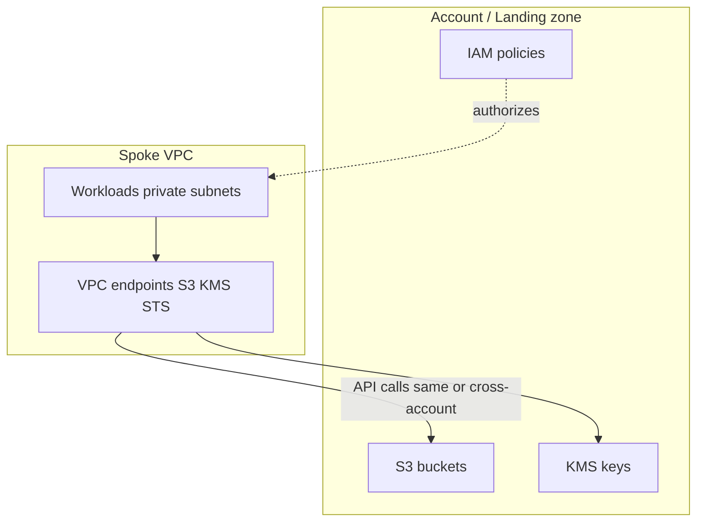
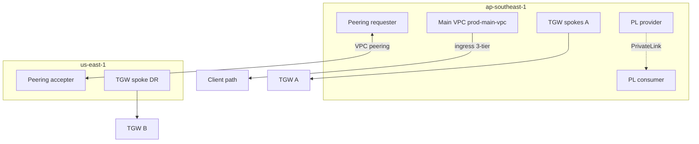
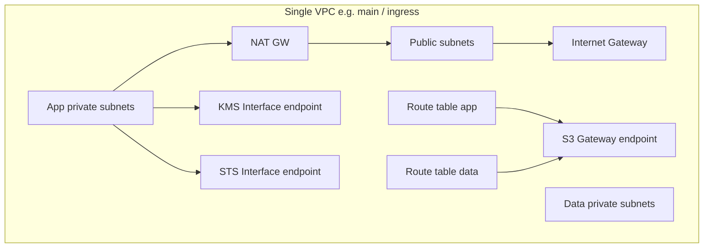
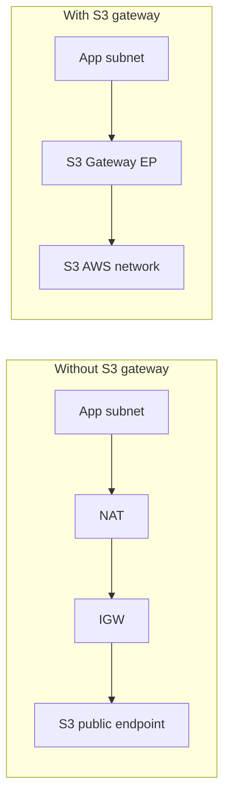
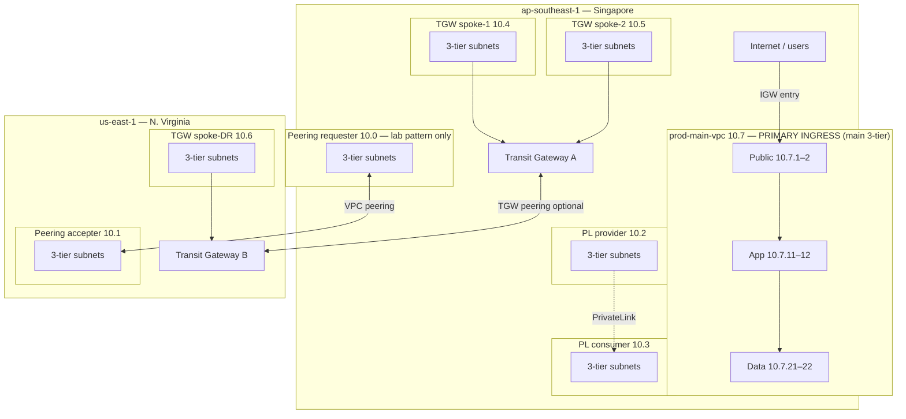
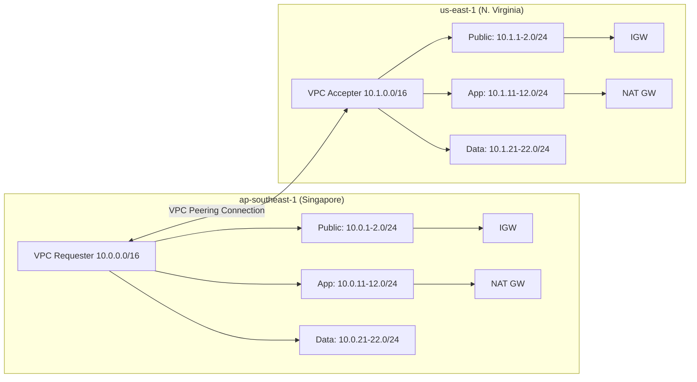
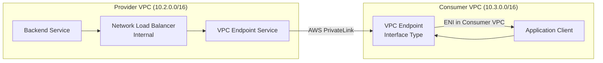
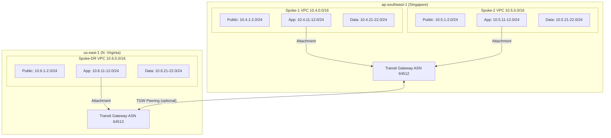
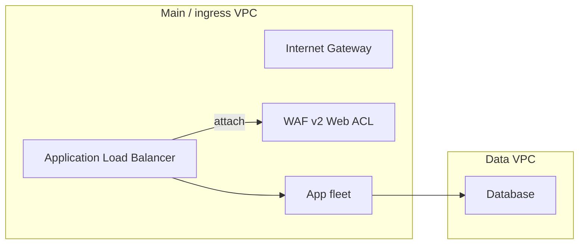

# VPC Enterprise Connectivity – Analysis Report

## 1. Introduction

This report analyzes three primary AWS VPC connectivity solutions for enterprise use, focusing on cross-region and multi-account scenarios. All implementations are tested on MiniStack to validate Terraform code without incurring AWS costs.

**Current context**: Single AWS Account, multi-region deployment. Planning for future multi-account migration.

### 1.1 Resource tagging (AWS)

Tagging follows the same *merge-and-identify* idea as common Terraform adapted to **AWS resource tags** in this repo:

- **Root / provider**: Each environment’s `provider "aws"` uses `default_tags` for cross-cutting keys (`Project`, `Environment`, `ManagedBy`).
- **Modules**: Every module under `modules/` defines `local.default_tags = merge(var.tags, { TerraformModule = basename(abspath(path.module)) })` so each resource merged with `local.default_tags` carries the **folder name** of the module (e.g. `vpc-base`, `privatelink`) without hardcoding. Per-resource `Name` tags stay on individual resources.

| Tag | Where set | Purpose |
|-----|-----------|---------|
| `Project`, `Environment`, `ManagedBy` | `default_tags` in `environments/*/providers.tf` | Lab-wide identity and ownership |
| `TerraformModule` | `local.default_tags` in each module | Which Terraform module created the resource |
| `Name` | Per-resource `merge(local.default_tags, { Name = ... })` | Human-readable resource name |

You can extend `var.tags` at the environment level with keys such as `Team` or `CostCenter` on real AWS accounts; enable those keys in **Cost allocation tags** if you use Cost Explorer.

### 1.2 Network conventions: landing zone vs spoke, VPC naming, VPC endpoints

**Landing zone vs spoke.** S3 buckets, KMS keys, and organization-level policies typically live at the **account / landing-zone** layer—not inside a spoke VPC. A spoke VPC uses **VPC endpoints** and **IAM** so workloads in private subnets call AWS APIs without relying on the public internet for those calls. IAM decides *what* is allowed; endpoints steer *where* traffic goes (private AWS backbone vs NAT/IGW).

**Prod lab — roles of each VPC (current layout).** The **main / ingress VPC** (`prod-main-vpc`, module `main_vpc` in Terraform) is the **primary 3-tier** entry point in `ap-southeast-1`. Peering, PrivateLink, and Transit Gateway are separate composed patterns (see architecture diagrams below).





**VPC naming (convention for new resources).** Wide renames in Terraform can force replacement; prefer these patterns for **new** VPCs and resources. Align CIDRs with [`subnet.csv`](./subnet.csv).

| Pattern | Suggested format | Example |
|---------|------------------|---------|
| Main / ingress | `{env}-main-vpc` or `{env}-main-{region}` | `prod-main-vpc`, `prod-main-apse1` |
| Peering | `{env}-peer-{side}-{region}` | `prod-peer-req-apse1`, `prod-peer-acc-use1` |
| PrivateLink | `{env}-pl-provider` / `{env}-pl-consumer` | `prod-pl-provider`, `prod-pl-consumer` |
| TGW spoke | `{env}-tgw-spoke-{name}` | `prod-tgw-spoke-1` (kebab-case, `prod-` prefix) |

**Gateway vs Interface endpoints.** **S3 Gateway** endpoints attach to **route tables** (prefix lists toward S3 over the AWS network; traffic for that prefix does not use NAT/IGW). **KMS** and **STS Interface** endpoints use **ENIs** in subnets (here: **app** tier), a **security group** allowing **TCP 443** from the **VPC CIDR**, and `private_dns_enabled = true` so Regional API hostnames resolve to the endpoint.





| Service | Endpoint type | Placement in this lab (`modules/vpc-base`) |
|---------|---------------|---------------------------------------------|
| S3 | Gateway | Route tables for **app** and **data** tiers |
| KMS | Interface | **App** subnets; SG ingress 443 from VPC CIDR |
| STS | Interface | **App** subnets; SG ingress 443 from VPC CIDR |

**MVP scope:** Optional flags on `modules/vpc-base` are enabled for **`module.main_vpc`** (prod **`prod-main-vpc`**) in `environments/prod/terraform.tfvars`. Other prod VPCs (peering, PrivateLink, TGW spokes) and `environments/dev` keep endpoints **off** by default unless you set the same variables.

### 1.3 Prod VPC inventory (names in `terraform.tfvars`)

Every prod VPC has a **Name** tag you can set from the root module. **`main_vpc_name`** and **`tgw_spokes_*` map keys** were already visible in tfvars; **peering** and **PrivateLink** VPC names are now **`peering_*_vpc_name`** and **`pl_*_vpc_name`**. **Transit Gateway** resources (not spokes) use **`tgw_name_tag_region_a`** / **`tgw_name_tag_region_b`**. CIDRs stay under `*_cidr` / subnet lists / spoke maps — see [`subnet.csv`](./subnet.csv).

| VPC / resource | Region | Terraform module | Variable(s) in `environments/prod` | Role |
|----------------|--------|------------------|-----------------------------------|------|
| `prod-main-vpc` | ap-southeast-1 | `main_vpc` (`vpc-base`) | `main_vpc_name`, `main_*` subnets | Ingress 3-tier; optional S3/KMS/STS VPC endpoints |
| `prod-peering-requester` | ap-southeast-1 | `vpc_peering` | `peering_requester_vpc_name`, `peering_requester_*` | Peering demo — requester side |
| `prod-peering-accepter` | us-east-1 | `vpc_peering` | `peering_accepter_vpc_name`, `peering_accepter_*` | Peering demo — accepter side |
| `prod-pl-provider` | ap-southeast-1 | `privatelink` | `pl_provider_vpc_name`, `pl_provider_*` | PrivateLink NLB + endpoint **service** |
| `prod-pl-consumer` | ap-southeast-1 | `privatelink` | `pl_consumer_vpc_name`, `pl_consumer_*` | PrivateLink **interface** endpoint client |
| `prod-tgw-spoke-1`, `prod-tgw-spoke-2` | ap-southeast-1 | `transit_gateway` | Keys inside `tgw_spokes_region_a` + CIDR fields | TGW spokes (region A) |
| `prod-tgw-spoke-dr` | us-east-1 | `transit_gateway` | Keys inside `tgw_spokes_region_b` | TGW spoke (region B) |
| TGW (hub) | ap-southeast-1 / us-east-1 | `transit_gateway` | `tgw_name_tag_region_a`, `tgw_name_tag_region_b` | Transit Gateway **objects** (not VPCs) |

**Module defaults:** If you call `modules/vpc-peering` or `modules/privatelink` without setting VPC names, older **lab-default** strings (e.g. `vpc-peering-requester`, `privatelink-provider`) still apply. **`environments/prod`** sets the **`prod-*`** names above so the console matches [`subnet.csv`](./subnet.csv) and this table.

---

## 2. Architecture Diagrams

### 2.1 Prod Environment Overview (Multi-Region, 3-Tier Production-Ready)

Deployed across `ap-southeast-1` (Singapore) and `us-east-1` (N. Virginia) on MiniStack, combining all 3 connectivity patterns with full 3-tier architecture (public/app/data) for each VPC.

**Terraform mapping:** Which **`terraform.tfvars`** variable controls each VPC **Name** tag is in **§1.3** (inventory table).

**Naming:** Terraform uses **`module.main_vpc`** and variables `main_*` (see `environments/prod/terraform.tfvars`). The VPC **Name** tag is **`prod-main-vpc`**. In AWS networking, **edge** still means **network edge** (where internet traffic enters); this repo’s **main** VPC is that ingress 3-tier for `ap-southeast-1`. The diagram below shows **internet ingress into `prod-main-vpc`** so it does not look orphaned among the other patterns.

**VPC Summary:**
| VPC | CIDR | Region | Pattern |
|-----|------|--------|---------|
| prod-main-vpc | 10.7.0.0/16 | ap-southeast-1 | **Main / ingress** (3-tier) |
| prod-peering-requester | 10.0.0.0/16 | ap-southeast-1 | VPC Peering (3-tier) |
| prod-peering-accepter | 10.1.0.0/16 | us-east-1 | VPC Peering (3-tier) |
| prod-pl-provider | 10.2.0.0/16 | ap-southeast-1 | PrivateLink Provider (3-tier) |
| prod-pl-consumer | 10.3.0.0/16 | ap-southeast-1 | PrivateLink Consumer (3-tier) |
| prod-tgw-spoke-1 | 10.4.0.0/16 | ap-southeast-1 | TGW Spoke (3-tier) |
| prod-tgw-spoke-2 | 10.5.0.0/16 | ap-southeast-1 | TGW Spoke (3-tier) |
| prod-tgw-spoke-dr | 10.6.0.0/16 | us-east-1 | TGW DR Spoke (3-tier) |



*The main ingress VPC is separate from peering / TGW / PrivateLink in this diagram: those links illustrate **other** connectivity patterns deployed in the same environment, not “children” of `prod-main-vpc`.*

---

### 2.2 VPC Peering (Cross-Region, 3-Tier)



**Key characteristics:**
- Point-to-point connection between two VPCs
- Non-transitive: if VPC-A peers with VPC-B and VPC-B peers with VPC-C, VPC-A cannot reach VPC-C through VPC-B
- Routes must be added explicitly in both VPCs
- CIDRs must not overlap
- Security groups control traffic between peered VPCs

### 2.3 AWS PrivateLink (Service-Level)



**Key characteristics:**
- Service-oriented: expose specific services, not entire VPCs
- Consumer only accesses exposed ports/services
- No CIDR overlap issues (uses ENIs in consumer VPC)
- Provider controls who can connect (acceptance model)
- Works cross-account natively
- Traffic stays on AWS backbone, never touches internet

### 2.4 AWS Transit Gateway (Hub-and-Spoke, 3-Tier)



**Key characteristics:**
- Hub-and-spoke: all VPCs connect to a central TGW
- **Transitive routing**: spoke-1 can reach spoke-2 through TGW (unlike peering)
- Cross-region via TGW peering
- Centralized route management
- Supports thousands of attachments
- Route tables provide segmentation and traffic control

### 2.5 AWS WAF v2 (Edge & Application Security)



**Key characteristics:**
- Web ACL inspects HTTP/S requests before reaching app targets (ALB/API GW)
- Support for managed rule groups (`AWSManagedRulesCommonRuleSet`), rate-based rules, IP sets
- `CreateWebACL`, `GetWebACL`, `UpdateWebACL`, `DeleteWebACL` (LockToken enforced)
- `CreateIPSet`, `UpdateIPSet`, `DeleteIPSet` for allow/deny lists
- `AssociateWebACL` and `DisassociateWebACL` to attach/detach from resource ARN
- Ideal to combine with TGW/PrivateLink for multi-account, cross-region security

---

## 3. Use-Case Comparison

| Criteria | VPC Peering | PrivateLink | Transit Gateway |
|---|---|---|---|
| **Topology** | Point-to-point | Service-oriented | Hub-and-spoke |
| **Best for** | 2-5 VPCs needing full network access | Exposing specific services to consumers | 5+ VPCs, centralized networking |
| **Cross-region** | Yes | Limited (same region preferred) | Yes (TGW peering) |
| **Cross-account** | Yes | Yes (primary use case) | Yes (RAM sharing) |
| **Transitive routing** | No | No (by design) | Yes |
| **Max connections** | 125 peering per VPC | Scales per service | 5,000 attachments per TGW |
| **CIDR overlap** | Not allowed | Allowed (uses ENIs) | Not allowed |

### 3.1 Practical Use-Case Scenarios

#### Scenario 1: Shared Database Cluster (e.g., RDS Aurora across teams)

| Solution | How it works | Verdict |
|---|---|---|
| **VPC Peering** | Each app VPC peers with the DB VPC. Apps connect to RDS endpoint directly. Simple when < 5 app VPCs. | Good for small scale |
| **PrivateLink** | DB team exposes RDS Proxy behind NLB as an endpoint service. App teams create VPC endpoints. DB team controls access with acceptance + SG. | Best practice — zero CIDR dependency, DB team retains control |
| **Transit Gateway** | All VPCs attach to TGW. Route 10.x.0.0/16 (DB VPC CIDR) via TGW. Works but exposes full DB VPC network. | Overkill unless TGW already exists for other reasons |

**Recommendation**: PrivateLink. The DB team can rotate, scale, or move the DB without impacting consumers.

#### Scenario 2: Centralized Logging / Monitoring (e.g., ELK, Datadog Agent, Prometheus)

| Solution | How it works | Verdict |
|---|---|---|
| **VPC Peering** | Peer each app VPC to the logging VPC. Agents in app VPCs push to log collector IP. Each new VPC = new peering + route. | Works but doesn't scale past ~10 VPCs |
| **PrivateLink** | Expose log ingest endpoint (Logstash/OTEL Collector behind NLB) via endpoint service. App VPCs consume it. | Clean. Per-service. Easy to add new consumers. |
| **Transit Gateway** | All VPCs route to logging VPC via TGW. Centralized. One route change propagates to all. | Best when you already have TGW + want bidirectional access (e.g., pull metrics from app VPCs) |

**Recommendation**: PrivateLink for push-only logging. TGW if you also need to pull metrics or access app VPCs from the monitoring VPC.

#### Scenario 3: Multi-Region Active-Active Application

| Solution | How it works | Verdict |
|---|---|---|
| **VPC Peering** | Peer us-east-1 VPC with eu-west-1 VPC. Simple for 2 regions. Breaks down at 4+ regions (n^2 peering). | Good for 2-3 regions |
| **PrivateLink** | Not designed for region-level full connectivity. | Not applicable |
| **Transit Gateway** | TGW per region + TGW peering. Add a new region = 1 new TGW + 1 peering attachment. Routes propagate. | Best for 3+ regions |

**Recommendation**: VPC Peering if exactly 2 regions. Transit Gateway at 3+.

#### Scenario 4: Dev/Staging/Prod Environment Isolation (same account)

| Solution | How it works | Verdict |
|---|---|---|
| **VPC Peering** | Peer shared-services VPC (CI/CD, artifacts) with dev, staging, prod VPCs. 3 peerings. Never peer dev↔prod directly. | Simple, effective, explicit isolation |
| **PrivateLink** | Expose shared services (artifact repo, internal APIs) as endpoints. Each env VPC consumes only what it needs. | More secure — no broad network access between envs |
| **Transit Gateway** | Central TGW with separate route tables per env. TGW route table for "dev" only sees dev + shared. Prod route table only sees prod + shared. | Most powerful — can enforce network segmentation centrally |

**Recommendation**: VPC Peering for < 5 envs. TGW with route table segmentation for enforced isolation at scale.

#### Scenario 5: Third-Party / Partner Integration

| Solution | How it works | Verdict |
|---|---|---|
| **VPC Peering** | Requires cross-account peering. Exposes your full VPC CIDR to the partner. Security risk. | Avoid for external partners |
| **PrivateLink** | Expose only the API/service the partner needs. Partner creates endpoint in their VPC. You control who connects. | Best practice for partner integration |
| **Transit Gateway** | Overkill. Sharing TGW via RAM with external parties gives too much access. | Not recommended for external parties |

**Recommendation**: PrivateLink is the only appropriate choice for external/partner integration.

#### Scenario 6: Centralized Egress / Internet Gateway (NAT consolidation)

| Solution | How it works | Verdict |
|---|---|---|
| **VPC Peering** | Cannot do transitive routing. Each VPC still needs its own NAT Gateway. | Not applicable |
| **PrivateLink** | Not designed for routing internet traffic. | Not applicable |
| **Transit Gateway** | All VPCs route 0.0.0.0/0 to TGW → egress VPC with NAT Gateways. Centralizes NAT costs. | Only solution that works |

**Recommendation**: Transit Gateway. This is one of TGW's killer features — saves significant NAT Gateway costs ($32/month/AZ each).

#### Scenario 7: Network Firewall / IDS Inspection

| Solution | How it works | Verdict |
|---|---|---|
| **VPC Peering** | No way to insert a firewall in the peering path. | Not possible |
| **PrivateLink** | Not designed for traffic inspection. | Not possible |
| **Transit Gateway** | Route inter-VPC traffic through an inspection VPC (AWS Network Firewall / third-party IDS) using TGW routing. | Only solution for centralized inspection |

**Recommendation**: Transit Gateway. Required for compliance regimes (PCI-DSS, HIPAA) that mandate traffic inspection.

#### Scenario 8: Hybrid Cloud (on-prem ↔ AWS via VPN/Direct Connect)

| Solution | How it works | Verdict |
|---|---|---|
| **VPC Peering** | On-prem connects to one VPC via VPN. That VPC cannot transitively route to other peered VPCs. Dead end. | Doesn't work beyond 1 VPC |
| **PrivateLink** | Can expose specific services to on-prem via PrivateLink + VPN. But limited to service-level. | Works for specific service access |
| **Transit Gateway** | Attach VPN/Direct Connect to TGW. All VPCs reachable from on-prem via TGW routes. Single point of entry. | Best and most common pattern |

**Recommendation**: Transit Gateway for full hybrid connectivity. PrivateLink as a complement for specific services.

### 3.2 Decision Summary

| Your situation | Use |
|---|---|
| 2-3 VPCs, simple connectivity | VPC Peering |
| Expose a service to consumers (internal or external) | PrivateLink |
| 5+ VPCs, any region count | Transit Gateway |
| Centralized NAT / egress | Transit Gateway |
| Network inspection / firewall | Transit Gateway |
| Partner / third-party access | PrivateLink |
| Hybrid (on-prem + AWS) | Transit Gateway + PrivateLink |
| Multi-region active-active (2 regions) | VPC Peering |
| Multi-region active-active (3+ regions) | Transit Gateway |
| Microservices across accounts | PrivateLink + Transit Gateway backbone |

---

## 4. Trade-Off Analysis

| Factor | VPC Peering | PrivateLink | Transit Gateway |
|---|---|---|---|
| **Monthly cost** | $0 (data transfer only: $0.01/GB same-region, ~$0.02/GB cross-region) | ~$7.5/endpoint/month + $0.01/GB processed | ~$36/attachment/month + $0.05/GB processed |
| **Setup complexity** | Low (2-3 resources per connection) | Medium (NLB + Endpoint Service + Endpoint) | High (TGW + attachments + route tables + propagation) |
| **Operational overhead** | Low (but N*(N-1)/2 connections for full mesh) | Medium (manage endpoint services & permissions) | Medium-High (centralized but complex route tables) |
| **Scalability** | Poor (O(n^2) connections) | Excellent (per-service, independent) | Excellent (hub-and-spoke, O(n)) |
| **Security granularity** | Coarse (Security Groups on full VPC CIDR) | Fine (service-level, port-level, acceptance model) | Medium (TGW route tables, can segment) |
| **Latency** | Lowest (direct path) | Low (extra ENI hop) | Slightly higher (TGW hop) |
| **Bandwidth** | No limit (AWS backbone) | No limit | Up to 50 Gbps per VPC attachment |
| **DNS resolution** | Requires manual config | Private DNS supported | Requires DNS setup (Route 53 Resolver) |
| **Failure blast radius** | Single connection | Single endpoint service | TGW failure affects all attached VPCs |
| **Monitoring** | VPC Flow Logs | VPC Flow Logs + Endpoint metrics | TGW Flow Logs + CloudWatch metrics |
| **IaC complexity** | Simple | Medium | High (especially cross-region) |

### Cost Example: 10 VPCs, 100GB/month inter-VPC traffic

| Solution | Monthly estimate |
|---|---|
| VPC Peering (full mesh = 45 connections) | ~$1 (data transfer only) |
| PrivateLink (10 endpoints) | ~$75 + $1 = ~$76 |
| Transit Gateway (10 attachments) | ~$360 + $5 = ~$365 |

---

## 5. Recommendation for Single-Account Multi-Region

Given the current setup (single account, multi-region):

### Short-term / Development (Dev Environment):
**Utilize the `vpc-base` module in 1 Region (ap-southeast-1)**.
- Deploy a single VPC with a 3-tier subnet architecture (Public, App, Data)
- Run across 3 Availability Zones with 3 NAT Gateways for High Availability
- Sufficient for exhaustive development and testing without overly complex networking

### Production Environment (Multi-Region Prod Environment):
**Combine all 3 networking techniques for complex AWS architecture (Deployed)**.
- Use **VPC Peering** for direct connection between two Application VPCs across Singapore and N. Virginia.
- Use **Transit Gateway** as the central hub in each region to connect App, Data, and Spoke VPCs.
- Use **PrivateLink** to expose internal shared services securely without opening a peering connection.

### Migration path:
```
Current:     VPC Peering (simple, cross-region)
     │
     ▼
Phase 2:     Transit Gateway (per-region) + TGW Peering (cross-region)
             + PrivateLink for specific services
     │
     ▼
Phase 3:     Multi-account with TGW shared via RAM
             + PrivateLink for cross-account service access
             + Network Firewall for centralized inspection
```

---

## 6. VPC Lattice (Out of Scope – Brief Note)

**Amazon VPC Lattice** is a newer application networking service (GA 2023) that operates at Layer 7 (HTTP/HTTPS/gRPC). Key differences from the three solutions above:

- **Application-layer**: Routes based on HTTP path, headers, methods – not IP/CIDR
- **Service mesh**: Provides service-to-service connectivity with built-in auth (IAM), observability, and traffic management
- **Cross-account native**: Designed for multi-account from day one using AWS RAM
- **No network-level config**: No route tables, no CIDRs, no peering – purely application-level
- **Complements, not replaces**: Use Lattice for app-to-app; use TGW/Peering for network-level connectivity

**When to consider**: If you're building microservices across multiple accounts and need L7 routing, auth, and observability without managing network plumbing.

---

## 7. MiniStack Testing & Validation

This project includes comprehensive test scripts that validate the Terraform implementations on MiniStack. The tests verify both resource creation and configuration correctness.

### Test Scripts Overview

| Script | Tests | Validation Points |
|---|---|---|
| `test-all.sh` | Dev + Prod integration | Init/apply/output/destroy for `environments/dev` and `environments/prod` |

### What Tests Validate

**Resource State Verification:**
- VPC creation and CIDR assignment
- Subnet creation and route table associations
- Security group rules and ingress/egress configuration
- Route table entries and propagation

**Connectivity Configuration:**
- VPC peering connection acceptance and active status
- Transit Gateway attachment availability
- VPC endpoint service and consumer endpoint states
- Cross-region resource references and dependencies

**Infrastructure Completeness:**
- All required resources are created
- Terraform outputs contain valid resource IDs
- Provider aliases work correctly for multi-region deployments
- Resource dependencies are properly modeled

### MiniStack Features Used

- **EC2 Service**: Full VPC, subnet, route table, security group, peering support
- **ELBv2**: Network Load Balancer for PrivateLink
- **Multi-region Simulation**: Cross-region resources in single container
- **Resource State Management**: Proper state transitions and dependencies

### Limitations & Notes

- **Control Plane Only**: Tests validate AWS API responses, not actual network packet flow
- **Instant State Changes**: MiniStack may return resources as "available" immediately vs. real AWS timing
- **No Data Plane Traffic**: Cannot test actual ICMP/TCP connectivity between VPCs
- **Simulated Cross-Region**: All regions run in one container for testing convenience
- **Transit Gateway Limitations**: Transit Gateway APIs may be incomplete in current MiniStack release
- **PrivateLink Limitation**: `aws_vpc_endpoint_service` APIs may be partial; validate before relying on provider-side flows

> **Note:** For a fully detailed matrix of supported services, emulator nuances, and recovery procedures for known issues (like the TGW cross-region peering hang), please refer to [API Support & Limitations](./support.md).

### Running Tests

```bash
# Run full suite (dev + prod)
./scripts/test-all.sh
```

Tests use AWS CLI with MiniStack endpoints and dummy credentials for API validation.

---

## 8. Enterprise MiniStack Emulation 

Instead of deploying directly onto Real AWS, this entire project is targeting **MiniStack enterprise emulation**, incorporating realistic settings for learning and training purposes.

### IP / Subnet Design
We apply a strict separation model for IP blocks across 8 different VPCs in 2 Regions to avoid IP overlap. Each prod VPC follows the 3-tier architecture (public/app/data).

*See detailed IP allocation plan in [subnet.csv](./subnet.csv)*.

### 8.1 Dev Environment (3-AZ Full Setup)
The Development environment contains 1 VPC located in `ap-southeast-1` (Singapore). It applies the `vpc-base` module with a standard enterprise emulation configuration:
- **3-tier Architecture**: `Public` (ALB/IGW), `Private App` (EC2/EKS), `Private Data` (RDS)
- **High Availability**: Subnets are spread across **3 Availability Zones** (`ap-southeast-1a`, `ap-southeast-1b`, `ap-southeast-1c`).
- **Realistic emulation**: Runs 3 NAT Gateways to fully cover the public layer.
- **WAF v2 (optional)**: `aws_wafv2_web_acl` + IP set available for ALB layer

```mermaid
graph TD
    subgraph "ap-southeast-1 (MiniStack)"
        IGW[Internet Gateway]
        ALB[ALB (public)]
        WAF[WAF v2 Web ACL]
        DB[Data (RDS)]
        APP[App Instances]
        PUB[Public Subnets]
        APP_SUB[App Subnets]
        DATA_SUB[Data Subnets]
        NAT[NAT GW]

        ALB -->|Inspect| WAF
        ALB --> APP
        APP --> DATA
        APP --> NAT

        PUB --> IGW
        APP_SUB --> APP
        DATA_SUB --> DATA

        WAF -- optional --> APP
    end
```

### 8.2 Verification Steps
- Run `terraform -chdir=environments/dev apply -auto-approve`
- Run `terraform -chdir=environments/prod apply -auto-approve`
- Run `terraform -chdir=environments/dev destroy -auto-approve` and `terraform -chdir=environments/prod destroy -auto-approve`

---

## 9. Project Implementation Details

### Module Structure

```
modules/
├── vpc-base/              # 3-Tier standalone VPC (used by dev + prod main_vpc)
│   ├── main.tf           # VPC, IGW, NAT, 3-tier subnets, RTs, SGs
│   ├── variables.tf
│   └── outputs.tf
├── vpc-peering/           # Cross-region VPC peering with 3-tier
│   ├── main.tf           # 2 VPCs (3-tier each), IGW, NAT, peering, routes, SGs
│   ├── variables.tf      # CIDRs, public/app/data subnets, NAT toggle
│   └── outputs.tf        # VPC IDs, subnet IDs per tier, SG IDs
├── privatelink/          # PrivateLink service exposure with 3-tier
│   ├── main.tf           # Provider + Consumer VPCs (3-tier), NLB, endpoint
│   ├── variables.tf      # CIDRs, public/app/data subnets, service port
│   └── outputs.tf        # Endpoint service name, subnet IDs, SG IDs
├── transit-gateway/      # Hub-and-spoke with 3-tier spokes
│   ├── main.tf           # TGWs, spoke VPCs (3-tier), attachments, routes
│   ├── variables.tf      # Spoke definitions with public/app/data subnets
│   └── outputs.tf        # TGW IDs, spoke subnet IDs, SG IDs per tier
└── waf-v2/               # WAF v2 Web ACL and IP sets
    ├── main.tf           # Web ACL, rules, IP set, associations
    ├── variables.tf
    └── outputs.tf
```

### Environment Configurations

```text
environments/
├── dev/                  # MiniStack Dev (Singapore, 3 AZs)
└── prod/                 # MiniStack Prod (Multi-region: SG, US-East)
```

Note: architecture sections still describe VPC Peering, PrivateLink, and Transit Gateway patterns; these are now composed through `environments/prod` rather than standalone environment roots.

Each environment includes:
- `main.tf`: Root module with provider configurations
- `outputs.tf`: Environment-specific outputs
- Multi-region AWS provider aliases for cross-region resources

### Key Terraform Patterns Used

**Cross-Region Providers:**
```hcl
provider "aws" {
  alias  = "requester"
  region = "us-east-1"
}

provider "aws" {
  alias  = "accepter"
  region = "eu-west-1"
}
```

**Resource References Across Regions:**
```hcl
resource "aws_vpc_peering_connection" "this" {
  provider    = aws.requester
  vpc_id      = aws_vpc.requester.id
  peer_vpc_id = aws_vpc.accepter.id
  peer_region = data.aws_region.accepter.id
}
```

**Conditional Resource Creation:**
```hcl
resource "aws_vpc_peering_connection_accepter" "this" {
  provider                  = aws.accepter
  vpc_peering_connection_id = aws_vpc_peering_connection.this.id
  auto_accept               = true
}
```

### Security Considerations

- **Security Groups**: Properly configured ingress/egress rules
- **Route Tables**: Explicit routes for peered VPCs
- **PrivateLink**: Acceptance-based access control
- **TGW Route Tables**: Segmentation and traffic isolation

### Cost Optimization

- **MiniStack Testing**: Zero AWS costs for development/testing
- **Resource Tagging**: Consistent tagging for cost allocation
- **Modular Design**: Reusable modules across environments

---

## 10. Summary Table

| Solution | Complexity | Cost | Scalability | Security | Applied To |
|---|---|---|---|---|---|
| Module `vpc-base` | Low | Low | Low (standalone) | 3-tier standard | `environments/dev` |
| VPC Peering | Low | Low | Poor (O(n²)) | Coarse | `environments/prod` (Cross-Region App) |
| PrivateLink | Medium | Medium | Excellent | Fine-grained | `environments/prod` (Service endpoint) |
| Transit Gateway | High | High | Excellent (O(n)) | Centralized | `environments/prod` (Cross-region spokes) |

---

*Report generated as part of VPC Connectivity Lab – terraform-aws-ministack*
