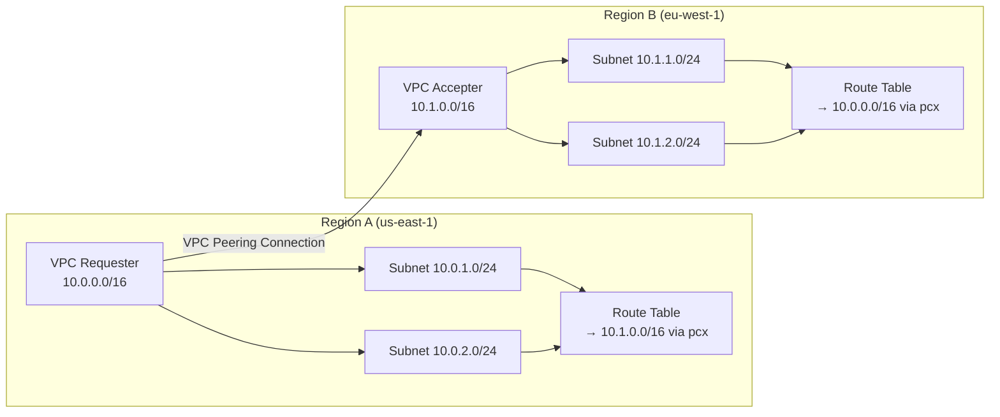
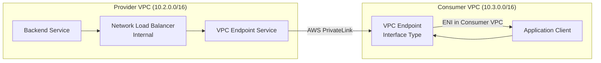
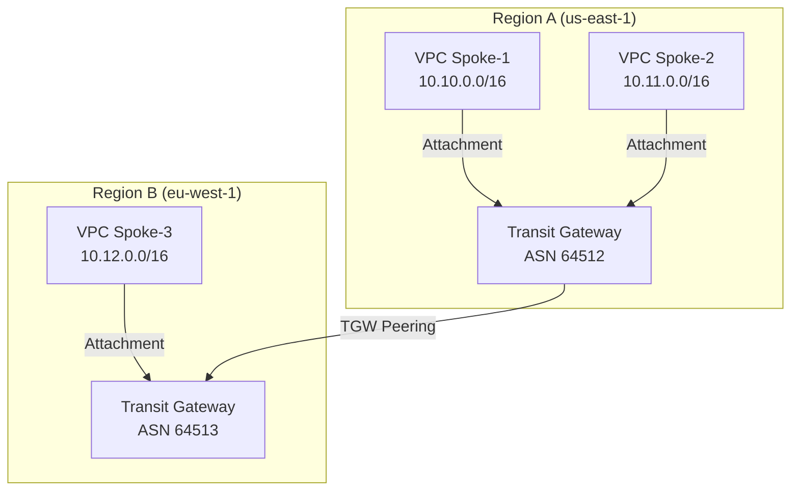

# VPC Enterprise Connectivity – Analysis Report

## 1. Introduction

This report analyzes three primary AWS VPC connectivity solutions for enterprise use, focusing on cross-region and multi-account scenarios. All implementations are tested on LocalStack to validate Terraform code without incurring AWS costs.

**Current context**: Single AWS Account, multi-region deployment. Planning for future multi-account migration.

---

## 2. Architecture Diagrams

### 2.1 VPC Peering (Cross-Region)



**Key characteristics:**
- Point-to-point connection between two VPCs
- Non-transitive: if VPC-A peers with VPC-B and VPC-B peers with VPC-C, VPC-A cannot reach VPC-C through VPC-B
- Routes must be added explicitly in both VPCs
- CIDRs must not overlap
- Security groups control traffic between peered VPCs

### 2.2 AWS PrivateLink (Service-Level)



**Key characteristics:**
- Service-oriented: expose specific services, not entire VPCs
- Consumer only accesses exposed ports/services
- No CIDR overlap issues (uses ENIs in consumer VPC)
- Provider controls who can connect (acceptance model)
- Works cross-account natively
- Traffic stays on AWS backbone, never touches internet

### 2.3 AWS Transit Gateway (Hub-and-Spoke)



**Key characteristics:**
- Hub-and-spoke: all VPCs connect to a central TGW
- **Transitive routing**: spoke-1 can reach spoke-2 through TGW (unlike peering)
- Cross-region via TGW peering
- Centralized route management
- Supports thousands of attachments
- Route tables provide segmentation and traffic control

---

## 3. Use-Case Comparison

| Criteria | VPC Peering | PrivateLink | Transit Gateway |
|---|---|---|---|
| **Topology** | Point-to-point | Service-oriented | Hub-and-spoke |
| **Best for** | 2-5 VPCs needing full network access | Exposing specific services to consumers | 5+ VPCs, centralized networking |
| **Cross-region** | Yes | Limited (same region preferred) | Yes (TGW peering) |
| **Cross-account** | Yes | Yes (primary use case) | Yes (RAM sharing) |
| **Transitive routing** | No | No (by design) | Yes |
| **Max connections** | 125 peering per VPC | Scales per service | 5,000 attachments per TGW |
| **CIDR overlap** | Not allowed | Allowed (uses ENIs) | Not allowed |

### 3.1 Practical Use-Case Scenarios

#### Scenario 1: Shared Database Cluster (e.g., RDS Aurora across teams)

| Solution | How it works | Verdict |
|---|---|---|
| **VPC Peering** | Each app VPC peers with the DB VPC. Apps connect to RDS endpoint directly. Simple when < 5 app VPCs. | Good for small scale |
| **PrivateLink** | DB team exposes RDS Proxy behind NLB as an endpoint service. App teams create VPC endpoints. DB team controls access with acceptance + SG. | Best practice — zero CIDR dependency, DB team retains control |
| **Transit Gateway** | All VPCs attach to TGW. Route 10.x.0.0/16 (DB VPC CIDR) via TGW. Works but exposes full DB VPC network. | Overkill unless TGW already exists for other reasons |

**Recommendation**: PrivateLink. The DB team can rotate, scale, or move the DB without impacting consumers.

#### Scenario 2: Centralized Logging / Monitoring (e.g., ELK, Datadog Agent, Prometheus)

| Solution | How it works | Verdict |
|---|---|---|
| **VPC Peering** | Peer each app VPC to the logging VPC. Agents in app VPCs push to log collector IP. Each new VPC = new peering + route. | Works but doesn't scale past ~10 VPCs |
| **PrivateLink** | Expose log ingest endpoint (Logstash/OTEL Collector behind NLB) via endpoint service. App VPCs consume it. | Clean. Per-service. Easy to add new consumers. |
| **Transit Gateway** | All VPCs route to logging VPC via TGW. Centralized. One route change propagates to all. | Best when you already have TGW + want bidirectional access (e.g., pull metrics from app VPCs) |

**Recommendation**: PrivateLink for push-only logging. TGW if you also need to pull metrics or access app VPCs from the monitoring VPC.

#### Scenario 3: Multi-Region Active-Active Application

| Solution | How it works | Verdict |
|---|---|---|
| **VPC Peering** | Peer us-east-1 VPC with eu-west-1 VPC. Simple for 2 regions. Breaks down at 4+ regions (n^2 peering). | Good for 2-3 regions |
| **PrivateLink** | Not designed for region-level full connectivity. | Not applicable |
| **Transit Gateway** | TGW per region + TGW peering. Add a new region = 1 new TGW + 1 peering attachment. Routes propagate. | Best for 3+ regions |

**Recommendation**: VPC Peering if exactly 2 regions. Transit Gateway at 3+.

#### Scenario 4: Dev/Staging/Prod Environment Isolation (same account)

| Solution | How it works | Verdict |
|---|---|---|
| **VPC Peering** | Peer shared-services VPC (CI/CD, artifacts) with dev, staging, prod VPCs. 3 peerings. Never peer dev↔prod directly. | Simple, effective, explicit isolation |
| **PrivateLink** | Expose shared services (artifact repo, internal APIs) as endpoints. Each env VPC consumes only what it needs. | More secure — no broad network access between envs |
| **Transit Gateway** | Central TGW with separate route tables per env. TGW route table for "dev" only sees dev + shared. Prod route table only sees prod + shared. | Most powerful — can enforce network segmentation centrally |

**Recommendation**: VPC Peering for < 5 envs. TGW with route table segmentation for enforced isolation at scale.

#### Scenario 5: Third-Party / Partner Integration

| Solution | How it works | Verdict |
|---|---|---|
| **VPC Peering** | Requires cross-account peering. Exposes your full VPC CIDR to the partner. Security risk. | Avoid for external partners |
| **PrivateLink** | Expose only the API/service the partner needs. Partner creates endpoint in their VPC. You control who connects. | Best practice for partner integration |
| **Transit Gateway** | Overkill. Sharing TGW via RAM with external parties gives too much access. | Not recommended for external parties |

**Recommendation**: PrivateLink is the only appropriate choice for external/partner integration.

#### Scenario 6: Centralized Egress / Internet Gateway (NAT consolidation)

| Solution | How it works | Verdict |
|---|---|---|
| **VPC Peering** | Cannot do transitive routing. Each VPC still needs its own NAT Gateway. | Not applicable |
| **PrivateLink** | Not designed for routing internet traffic. | Not applicable |
| **Transit Gateway** | All VPCs route 0.0.0.0/0 to TGW → egress VPC with NAT Gateways. Centralizes NAT costs. | Only solution that works |

**Recommendation**: Transit Gateway. This is one of TGW's killer features — saves significant NAT Gateway costs ($32/month/AZ each).

#### Scenario 7: Network Firewall / IDS Inspection

| Solution | How it works | Verdict |
|---|---|---|
| **VPC Peering** | No way to insert a firewall in the peering path. | Not possible |
| **PrivateLink** | Not designed for traffic inspection. | Not possible |
| **Transit Gateway** | Route inter-VPC traffic through an inspection VPC (AWS Network Firewall / third-party IDS) using TGW routing. | Only solution for centralized inspection |

**Recommendation**: Transit Gateway. Required for compliance regimes (PCI-DSS, HIPAA) that mandate traffic inspection.

#### Scenario 8: Hybrid Cloud (on-prem ↔ AWS via VPN/Direct Connect)

| Solution | How it works | Verdict |
|---|---|---|
| **VPC Peering** | On-prem connects to one VPC via VPN. That VPC cannot transitively route to other peered VPCs. Dead end. | Doesn't work beyond 1 VPC |
| **PrivateLink** | Can expose specific services to on-prem via PrivateLink + VPN. But limited to service-level. | Works for specific service access |
| **Transit Gateway** | Attach VPN/Direct Connect to TGW. All VPCs reachable from on-prem via TGW routes. Single point of entry. | Best and most common pattern |

**Recommendation**: Transit Gateway for full hybrid connectivity. PrivateLink as a complement for specific services.

### 3.2 Decision Summary

| Your situation | Use |
|---|---|
| 2-3 VPCs, simple connectivity | VPC Peering |
| Expose a service to consumers (internal or external) | PrivateLink |
| 5+ VPCs, any region count | Transit Gateway |
| Centralized NAT / egress | Transit Gateway |
| Network inspection / firewall | Transit Gateway |
| Partner / third-party access | PrivateLink |
| Hybrid (on-prem + AWS) | Transit Gateway + PrivateLink |
| Multi-region active-active (2 regions) | VPC Peering |
| Multi-region active-active (3+ regions) | Transit Gateway |
| Microservices across accounts | PrivateLink + Transit Gateway backbone |

---

## 4. Trade-Off Analysis

| Factor | VPC Peering | PrivateLink | Transit Gateway |
|---|---|---|---|
| **Monthly cost** | $0 (data transfer only: $0.01/GB same-region, ~$0.02/GB cross-region) | ~$7.5/endpoint/month + $0.01/GB processed | ~$36/attachment/month + $0.05/GB processed |
| **Setup complexity** | Low (2-3 resources per connection) | Medium (NLB + Endpoint Service + Endpoint) | High (TGW + attachments + route tables + propagation) |
| **Operational overhead** | Low (but N*(N-1)/2 connections for full mesh) | Medium (manage endpoint services & permissions) | Medium-High (centralized but complex route tables) |
| **Scalability** | Poor (O(n^2) connections) | Excellent (per-service, independent) | Excellent (hub-and-spoke, O(n)) |
| **Security granularity** | Coarse (Security Groups on full VPC CIDR) | Fine (service-level, port-level, acceptance model) | Medium (TGW route tables, can segment) |
| **Latency** | Lowest (direct path) | Low (extra ENI hop) | Slightly higher (TGW hop) |
| **Bandwidth** | No limit (AWS backbone) | No limit | Up to 50 Gbps per VPC attachment |
| **DNS resolution** | Requires manual config | Private DNS supported | Requires DNS setup (Route 53 Resolver) |
| **Failure blast radius** | Single connection | Single endpoint service | TGW failure affects all attached VPCs |
| **Monitoring** | VPC Flow Logs | VPC Flow Logs + Endpoint metrics | TGW Flow Logs + CloudWatch metrics |
| **IaC complexity** | Simple | Medium | High (especially cross-region) |

### Cost Example: 10 VPCs, 100GB/month inter-VPC traffic

| Solution | Monthly estimate |
|---|---|
| VPC Peering (full mesh = 45 connections) | ~$1 (data transfer only) |
| PrivateLink (10 endpoints) | ~$75 + $1 = ~$76 |
| Transit Gateway (10 attachments) | ~$360 + $5 = ~$365 |

---

## 5. Recommendation for Single-Account Multi-Region

Given the current setup (single account, multi-region):

### Short-term (current state, < 5 VPCs per region):
**Use VPC Peering** for cross-region connectivity.
- Simplest to implement and operate
- Lowest cost
- Sufficient when VPC count is small
- Each region's VPC peers directly with counterparts in other regions

### Medium-term (growing to 5-10 VPCs):
**Migrate to Transit Gateway** within each region + TGW peering cross-region.
- Avoids the N^2 peering explosion
- Centralized route management
- Enables network inspection/firewall (AWS Network Firewall integration)
- Prepares for multi-account migration (TGW is shared via RAM)

### For specific service exposure:
**Add PrivateLink** for services that need controlled, service-level access.
- Use alongside either Peering or TGW
- Ideal when third-party integrations or partner access is needed
- Can coexist with TGW-based backbone

### Migration path:
```
Current:     VPC Peering (simple, cross-region)
     │
     ▼
Phase 2:     Transit Gateway (per-region) + TGW Peering (cross-region)
             + PrivateLink for specific services
     │
     ▼
Phase 3:     Multi-account with TGW shared via RAM
             + PrivateLink for cross-account service access
             + Network Firewall for centralized inspection
```

---

## 6. VPC Lattice (Out of Scope – Brief Note)

**Amazon VPC Lattice** is a newer application networking service (GA 2023) that operates at Layer 7 (HTTP/HTTPS/gRPC). Key differences from the three solutions above:

- **Application-layer**: Routes based on HTTP path, headers, methods – not IP/CIDR
- **Service mesh**: Provides service-to-service connectivity with built-in auth (IAM), observability, and traffic management
- **Cross-account native**: Designed for multi-account from day one using AWS RAM
- **No network-level config**: No route tables, no CIDRs, no peering – purely application-level
- **Complements, not replaces**: Use Lattice for app-to-app; use TGW/Peering for network-level connectivity

**When to consider**: If you're building microservices across multiple accounts and need L7 routing, auth, and observability without managing network plumbing.

---

## 7. LocalStack Testing & Validation

This project includes comprehensive test scripts that validate the Terraform implementations on LocalStack Pro. The tests verify both resource creation and configuration correctness.

### Test Scripts Overview

| Script | Tests | Validation Points |
|---|---|---|
| `test-vpc-peering.sh` | Cross-region VPC peering | Peering status, VPC existence, route table entries, security groups |
| `test-privatelink.sh` | PrivateLink service exposure | Endpoint service state, VPC endpoint availability, NLB configuration |
| `test-transit-gateway.sh` | Transit Gateway hub-and-spoke | TGW availability, attachment states, cross-region peering, route propagation |
| `test-all.sh` | Full test suite | Runs all individual tests sequentially |

### What Tests Validate

**Resource State Verification:**
- VPC creation and CIDR assignment
- Subnet creation and route table associations
- Security group rules and ingress/egress configuration
- Route table entries and propagation

**Connectivity Configuration:**
- VPC peering connection acceptance and active status
- Transit Gateway attachment availability
- VPC endpoint service and consumer endpoint states
- Cross-region resource references and dependencies

**Infrastructure Completeness:**
- All required resources are created
- Terraform outputs contain valid resource IDs
- Provider aliases work correctly for multi-region deployments
- Resource dependencies are properly modeled

### LocalStack Pro Features Used

- **EC2 Service**: Full VPC, subnet, route table, security group, peering support
- **ELBv2**: Network Load Balancer for PrivateLink
- **Multi-region Simulation**: Cross-region resources in single container
- **Resource State Management**: Proper state transitions and dependencies

### Limitations & Notes

- **Control Plane Only**: Tests validate AWS API responses, not actual network packet flow
- **Instant State Changes**: LocalStack may return resources as "available" immediately vs. real AWS timing
- **No Data Plane Traffic**: Cannot test actual ICMP/TCP connectivity between VPCs
- **Simulated Cross-Region**: All regions run in one container for testing convenience

### Running Tests

```bash
# Set LocalStack auth token
export LOCALSTACK_AUTH_TOKEN=your_token

# Run individual tests
./scripts/test-vpc-peering.sh
./scripts/test-privatelink.sh
./scripts/test-transit-gateway.sh

# Run full suite
./scripts/test-all.sh
```

Tests use AWS CLI with LocalStack endpoints and dummy credentials for API validation.

---

## 9. Project Implementation Details

### Module Structure

```
modules/
├── vpc-peering/           # Cross-region VPC peering
│   ├── main.tf           # VPCs, subnets, peering, routes, security groups
│   ├── variables.tf      # CIDRs, regions, tags
│   └── outputs.tf        # VPC IDs, peering connection, route tables
├── privatelink/          # PrivateLink service exposure
│   ├── main.tf           # NLB, endpoint service, consumer endpoint
│   ├── variables.tf      # Service ports, acceptance settings
│   └── outputs.tf        # Endpoint service name, consumer endpoint ID
└── transit-gateway/      # Hub-and-spoke networking
    ├── main.tf           # TGWs, attachments, peering, route tables
    ├── variables.tf      # Regions, ASN numbers, attachment settings
    └── outputs.tf        # TGW IDs, attachment states, peering status
```

### Environment Configurations

```
environments/
├── vpc-peering/          # Test environment for peering
├── privatelink/          # Test environment for PrivateLink
└── transit-gateway/      # Test environment for TGW
```

Each environment includes:
- `main.tf`: Root module with provider configurations
- `outputs.tf`: Environment-specific outputs
- Multi-region AWS provider aliases for cross-region resources

### Key Terraform Patterns Used

**Cross-Region Providers:**
```hcl
provider "aws" {
  alias  = "requester"
  region = "us-east-1"
}

provider "aws" {
  alias  = "accepter"
  region = "eu-west-1"
}
```

**Resource References Across Regions:**
```hcl
resource "aws_vpc_peering_connection" "this" {
  provider    = aws.requester
  vpc_id      = aws_vpc.requester.id
  peer_vpc_id = aws_vpc.accepter.id
  peer_region = data.aws_region.accepter.name
}
```

**Conditional Resource Creation:**
```hcl
resource "aws_vpc_peering_connection_accepter" "this" {
  provider                  = aws.accepter
  vpc_peering_connection_id = aws_vpc_peering_connection.this.id
  auto_accept               = true
}
```

### Security Considerations

- **Security Groups**: Properly configured ingress/egress rules
- **Route Tables**: Explicit routes for peered VPCs
- **PrivateLink**: Acceptance-based access control
- **TGW Route Tables**: Segmentation and traffic isolation

### Cost Optimization

- **LocalStack Testing**: Zero AWS costs for development/testing
- **Resource Tagging**: Consistent tagging for cost allocation
- **Modular Design**: Reusable modules across environments

---

## 10. Summary Table

| Solution | Complexity | Cost | Scalability | Security | Best For |
|---|---|---|---|---|---|
| VPC Peering | Low | Low | Poor (O(n²)) | Coarse | Small deployments (< 5 VPCs) |
| PrivateLink | Medium | Medium | Excellent | Fine-grained | Service exposure, SaaS |
| Transit Gateway | High | High | Excellent (O(n)) | Centralized | Enterprise, many VPCs |

---

*Report generated as part of VPC Connectivity Lab – terraform-aws-localstack*
