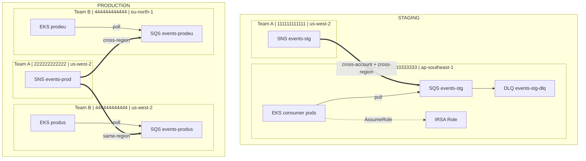

# Cross-Account SNS → SQS with IRSA — IAM Case Study

Case study thực tế: **Team A publish events qua SNS**, **Team B (chúng ta) consume qua SQS trên EKS** — cross-account, cross-region.

## Bối cảnh

```
Team A (Publisher)                    Team B — Chúng ta (Consumer)
─────────────────                    ────────────────────────────

Staging:                              Staging:
  Account: 111111111111                 Account: 333333333333
  Region:  us-west-2                    Region:  ap-southeast-1
  SNS:     events-stg                   SQS:     events-stg
                                        EKS:     consumer pods

Production:                           Production:
  Account: 222222222222                 Account: 444444444444
  Region:  us-west-2                    Region:  us-west-2  (produs) → SQS events-produs
  SNS:     events-prod                  Region:  eu-north-1 (prodeu) → SQS events-prodeu
                                        EKS:     consumer pods (cả 2 region)
```

**Pattern:** 1 SNS Topic → fan-out → N SQS Queues (cross-account, cross-region)

---

## Architecture Diagram



---

## IAM Resources cần tạo (từ góc nhìn Team B)

### Tổng quan resource theo vai trò

| # | Resource | Ai tạo | Mục đích |
|---|----------|--------|----------|
| 1 | `aws_sns_topic` | Team A | SNS topic để publish events |
| 2 | `aws_sns_topic_policy` | Team A | Cho phép Team B account subscribe |
| 3 | `aws_sqs_queue` | **Team B** | Queue nhận messages |
| 4 | `aws_sqs_queue` (DLQ) | **Team B** | Dead Letter Queue cho messages fail |
| 5 | `aws_sqs_queue_policy` | **Team B** | Cho phép SNS gửi message vào SQS |
| 6 | `aws_sns_topic_subscription` | **Team B** | Đăng ký SQS subscribe SNS topic |
| 7 | `aws_iam_openid_connect_provider` | **Team B** | OIDC provider cho EKS cluster |
| 8 | `aws_iam_role` | **Team B** | IRSA role cho consumer pods |
| 9 | `aws_iam_policy` | **Team B** | SQS read/delete permissions |
| 10 | `aws_iam_role_policy_attachment` | **Team B** | Gắn policy vào role |

### Chi tiết từng IAM Policy

#### SNS Topic Policy (Team A tạo, cho phép Team B subscribe)

```json
{
  "Effect": "Allow",
  "Principal": { "AWS": "arn:aws:iam::TEAM_B_ACCOUNT:root" },
  "Action": ["sns:Subscribe", "sns:Receive"],
  "Resource": "arn:aws:sns:us-west-2:TEAM_A_ACCOUNT:events-*"
}
```

**Tại sao cần?** SNS mặc định chỉ cho phép cùng account subscribe. Cross-account cần explicit topic policy.

#### SQS Queue Policy (Team B tạo, cho phép SNS gửi message)

```json
{
  "Effect": "Allow",
  "Principal": { "Service": "sns.amazonaws.com" },
  "Action": "sqs:SendMessage",
  "Resource": "arn:aws:sqs:REGION:TEAM_B_ACCOUNT:events-*",
  "Condition": {
    "ArnEquals": {
      "aws:SourceArn": "arn:aws:sns:us-west-2:TEAM_A_ACCOUNT:events-*"
    }
  }
}
```

**Tại sao Condition?** Không dùng condition = bất kỳ SNS topic nào cũng gửi được vào queue. `ArnEquals` lock đúng topic của Team A.

#### IRSA Trust Policy (cho EKS pods assume role)

```json
{
  "Effect": "Allow",
  "Principal": {
    "Federated": "arn:aws:iam::ACCOUNT:oidc-provider/oidc.eks.REGION.amazonaws.com/id/CLUSTER_ID"
  },
  "Action": "sts:AssumeRoleWithWebIdentity",
  "Condition": {
    "StringEquals": {
      "OIDC_URL:sub": "system:serviceaccount:NAMESPACE:SERVICE_ACCOUNT",
      "OIDC_URL:aud": "sts.amazonaws.com"
    }
  }
}
```

**Tại sao 2 conditions?**
- `:sub` = chỉ ServiceAccount cụ thể trong namespace cụ thể mới assume được
- `:aud` = chỉ chấp nhận token issued cho STS (prevent token reuse)

#### SQS Consumer Policy (permissions cho pods)

```json
{
  "Effect": "Allow",
  "Action": [
    "sqs:ReceiveMessage",
    "sqs:DeleteMessage",
    "sqs:GetQueueAttributes",
    "sqs:GetQueueUrl",
    "sqs:ChangeMessageVisibility"
  ],
  "Resource": ["arn:aws:sqs:REGION:ACCOUNT:events-*"]
}
```

**Least privilege:** Không cho `sqs:*` — chỉ 5 actions cần thiết cho consumer pattern.

---

## Message Flow

```
1. Team A app publishes event → SNS Topic (us-west-2)
2. SNS fan-out → delivers to all subscribed SQS queues
3. SQS queue (ap-southeast-1 hoặc eu-north-1) nhận message
4. EKS pod long-polls SQS (ReceiveMessage, wait 20s)
5. Pod processes message
6. Pod deletes message (DeleteMessage)
7. Nếu pod crash/timeout → message quay lại queue (visibility timeout)
8. Sau 3 lần fail → message chuyển vào DLQ
```

### Cross-Region Behavior

| Path | Latency | Behavior |
|------|---------|----------|
| SNS us-west-2 → SQS us-west-2 | ~ms | Same-region, fastest |
| SNS us-west-2 → SQS ap-southeast-1 | ~100-200ms | Cross-region, AWS backbone |
| SNS us-west-2 → SQS eu-north-1 | ~100-200ms | Cross-region, AWS backbone |

SNS handles cross-region delivery automatically — không cần VPC peering hay Transit Gateway.

---

## Project Structure

```
iam/
├── README.md              ← Tài liệu này
├── stg/                   ← Staging environment
│   ├── providers.tf       # 2 providers: default (Team B) + team_a
│   ├── variables.tf       # Account IDs, names, OIDC config
│   ├── main.tf            # 12 resources
│   └── outputs.tf         # ARNs, URLs, ServiceAccount annotation
└── prod/                  ← Production environment
    ├── providers.tf       # 3 providers: default (produs) + eu + team_a
    ├── variables.tf       # Account IDs, 2 regions, 2 OIDC configs
    ├── main.tf            # 17 resources
    └── outputs.tf         # ARNs for both regions
```

### Resource Count

| Environment | KMS | SNS | SQS | SQS Policy | Subscription | IAM OIDC | IAM Role | IAM Policy | Attachment | Total |
|-------------|-----|-----|-----|------------|--------------|----------|----------|------------|------------|-------|
| **stg** | 1 key + 1 alias | 1 topic + 1 policy | 2 (main + DLQ) | 1 | 1 | 1 | 1 | 1 | 1 | **12** |
| **prod** | 1 key + 1 alias | 1 topic + 1 policy | 4 (2 main + 2 DLQ) | 2 | 2 | 2 | 1 | 1 | 1 | **17** |

---

## Quick Start

```bash
# 1. Start MiniStack
docker compose up -d

# 2. Test Staging
cd iam/stg
terraform init
terraform apply -auto-approve
terraform output
terraform destroy -auto-approve

# 3. Test Production
cd ../prod
terraform init
terraform apply -auto-approve
terraform output
terraform destroy -auto-approve

# 4. Stop MiniStack
docker compose down -v
```

---

## MiniStack Compatibility

| Service | Supported | Used for |
|---------|-----------|----------|
| SNS | ✅ | Topic, Topic Policy, Subscription |
| SQS | ✅ | Queue, DLQ, Queue Policy |
| IAM | ✅ | Role, Policy, OIDC Provider, Attachment |
| STS | ✅ | AssumeRoleWithWebIdentity (IRSA concept) |

> **Note:** MiniStack không enforce IAM policies thực sự — policies được lưu và validate cú pháp nhưng không block/allow requests. Đây là lab để học cấu trúc IAM, không phải test enforcement.

---

## Kubernetes ServiceAccount Configuration

Sau khi Terraform apply, lấy annotation từ output để cấu hình IRSA:

```yaml
apiVersion: v1
kind: ServiceAccount
metadata:
  name: sqs-consumer
  namespace: events
  annotations:
    eks.amazonaws.com/role-arn: arn:aws:iam::444444444444:role/sqs-consumer-prod-role
```

```yaml
apiVersion: apps/v1
kind: Deployment
metadata:
  name: sqs-consumer
  namespace: events
spec:
  template:
    spec:
      serviceAccountName: sqs-consumer
      containers:
        - name: consumer
          env:
            - name: SQS_QUEUE_URL
              value: "https://sqs.us-west-2.amazonaws.com/444444444444/events-produs"
            - name: AWS_DEFAULT_REGION
              value: "us-west-2"
```

---

## So sánh Staging vs Production

| Aspect | Staging | Production |
|--------|---------|------------|
| Team A Account | 111111111111 | 222222222222 |
| Team B Account | 333333333333 | 444444444444 |
| SNS Region | us-west-2 | us-west-2 |
| SQS Regions | ap-southeast-1 | us-west-2 + eu-north-1 |
| Cross-region? | Yes (SNS→SQS) | Yes (SNS→SQS eu-north-1) |
| Cross-account? | Yes | Yes |
| # SQS queues | 1 | 2 (fan-out) |
| # EKS clusters | 1 | 2 |
| IRSA OIDC trusts | 1 | 2 (dual-region) |
| Total resources | 12 | 17 |

---

## Thực tế vs Lab

| Khác biệt | Thực tế (Real AWS) | Lab (MiniStack) |
|------------|-------------------|-----------------|
| Account ID | Mỗi team có account riêng | Tất cả dùng `000000000000` |
| Cross-account | Cần explicit resource policies | MiniStack không enforce |
| IRSA | EKS OIDC Provider thực | Placeholder OIDC URL |
| Encryption | SQS KMS encryption | Không bắt buộc trên emulator |
| Region latency | Thực sự khác nhau | Tất cả local |
| IAM enforcement | Policies block/allow | Policies stored only |

**Giá trị của lab:** Học đúng **cấu trúc** IAM policies, resource relationships, và Terraform patterns — áp dụng trực tiếp khi deploy lên AWS thật.
