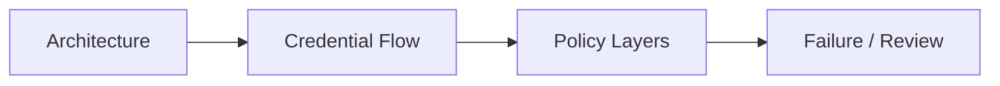
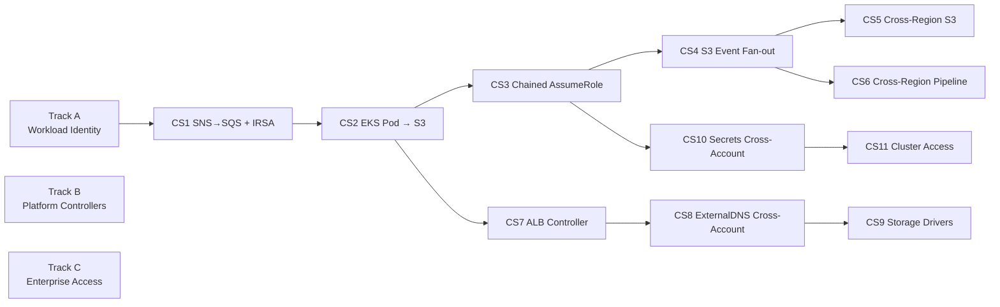

# IAM Case Studies — Diagram-First EKS IAM Curriculum

Bộ case study IAM cho EKS theo kiểu đi làm: bắt đầu từ scenario, nhìn sơ đồ để hiểu boundary, rồi mới phân tích trust, permission, resource policy, credential flow, và failure modes.

## Mô hình IAM chung

```text
Trust policy      = "Ai assume role này được?"
Permission policy = "Assume xong thì làm được gì?"
Resource policy   = "Tài nguyên có chấp nhận principal đó không?"
```

## Diagram-first standard

Mỗi case study trong `iam/` nên có đủ 4 sơ đồ:

1. `Architecture` — account, region, cluster, namespace, service account, resource boundary.
2. `Credential Flow` — Pod/Controller lấy credential theo IRSA, Pod Identity, hoặc AssumeRole chain như thế nào.
3. `Policy Layers` — trust, permission, resource policy, service integration policy.
4. `Failure / Review` — lỗi hay gặp và cách debug hoặc review.



## Curriculum map



## Case catalog

| # | Case Study | Folder | Lab Type | Scope | Key Concepts |
|---|---|---|---|---|---|
| 1 | [SNS→SQS + IRSA](stg/README.md) | `stg/`, `prod/` | MiniStack | Cross-account, cross-region | SNS topic policy, SQS queue policy, IRSA |
| 2 | [EKS Pod → S3](s3-eks/README.md) | `s3-eks/` | MiniStack | Same-account | IRSA vs Pod Identity, ABAC, bucket policy |
| 3 | [Cross-Account AssumeRole](cross-account/README.md) | `cross-account/` | MiniStack | Cross-account | Chained `AssumeRole`, `ExternalId`, confused deputy |
| 4 | [S3 Event Fan-out](s3-events/README.md) | `s3-events/` | MiniStack | Event-driven | 4-layer IAM chain, S3→SNS→SQS |
| 5 | [Cross-Region S3 CRR](cross-region-s3/README.md) | `cross-region-s3/` | MiniStack | Cross-region | Replication IAM, multi-cluster identity, RW/RO |
| 6 | [Cross-Region Pipeline](cross-region-pipeline/README.md) | `cross-region-pipeline/` | MiniStack | Cross-region | SNS delivery, DR queues, multi-region consumers |
| 7 | [ALB Controller on EKS](alb-controller/README.md) | `alb-controller/` | MiniStack runnable | Platform | Controller IAM, RBAC vs IAM, representative ALB lifecycle |
| 8 | [ExternalDNS Cross-Account](external-dns-cross-account/README.md) | `external-dns-cross-account/` | MiniStack runnable | Platform, cross-account | Shared-services DNS, Route53, AssumeRole |
| 9 | [Storage Drivers on EKS](storage-drivers/README.md) | `storage-drivers/` | MiniStack runnable | Platform | EBS CSI resources, EFS IAM shape, pod role isolation |
| 10 | [Secrets Access Cross-Account](cross-account-secrets/README.md) | `cross-account-secrets/` | MiniStack runnable | App workload, cross-account | Role chaining, secret/parameter ARN scoping |
| 11 | [Cluster Access & Break-Glass](cluster-access/README.md) | `cluster-access/` | MiniStack runnable | Human access | IAM guardrails, optional access-entry resources, break-glass admin |
| 12 | [Go BE → S3 Compute Matrix](s3-go-compute-matrix/README.md) | `s3-go-compute-matrix/` | MiniStack runnable | Same/cross-account, same/cross-region | EC2 instance profile, ECS task role, Lambda exec role, AssumeRole + ExternalId |

## Learning tracks

### Track A — Workload identity

Đi theo thứ tự:
- `s3-eks`
- `cross-account`
- `stg` / `prod`
- `s3-events`
- `cross-region-s3`
- `cross-region-pipeline`

Mục tiêu:
- đọc được trust policy có chặt hay không
- hiểu khi nào dùng IRSA, Pod Identity, hoặc AssumeRole chain
- phân biệt permission policy với bucket/topic/queue policy

### Track B — Platform controllers

Đi theo thứ tự:
- `alb-controller`
- `external-dns-cross-account`
- `storage-drivers`

Mục tiêu:
- biết controller nào cần IAM role riêng
- tránh nhét quyền vào node role
- hiểu khác biệt giữa Kubernetes RBAC và AWS IAM

### Track C — Enterprise access

Đi theo thứ tự:
- `cross-account-secrets`
- `cluster-access`

Mục tiêu:
- tách bạch human access với pod access
- review được mô hình multi-account và break-glass
- giải thích được audit trail và blast radius

## Review checklist cho mọi case

- Principal nào assume role?
- Credential được mint ở đâu: STS, EKS Auth, hay role chaining?
- Resource nào còn wildcard quá rộng?
- Có đủ condition như `:sub`, `:aud`, `aws:SourceArn`, `sts:ExternalId`, `aws:SourceOrgId` chưa?
- Nếu pod không lấy được credential thì debug ở trust, SDK, association, hay instance profile?

## Quick start

```bash
# Validate + apply case study đã có Terraform runnable
cd iam/<folder>
terraform init -input=false
terraform apply -auto-approve
terraform output
terraform destroy -auto-approve
```

## MiniStack compatibility

| Service | Supported | Notes |
|---------|:---------:|-------|
| IAM | ✅ | Roles, policies, OIDC providers — syntax validated, not enforced |
| S3 | ✅ | Buckets, versioning, encryption, policies, notifications |
| SNS | ✅ | Topics, policies, subscriptions |
| SQS | ✅ | Queues, DLQ, policies |
| STS | ✅ | `AssumeRole` concepts are emulated |
| EKS control plane features | ⚠️ Partial | Pod Identity Agent, Access Entries, controllers are mainly design-study topics |
| Route53 / ELB / CSI drivers | ⚠️ Mixed | Good for IAM design and Terraform shape, not full local behavior |

> **Note:** MiniStack giúp validate shape của IAM resources. Nó không chứng minh production enforcement, controller behavior, hay Kubernetes add-on lifecycle như trên AWS thật.
