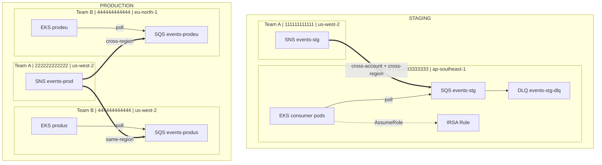
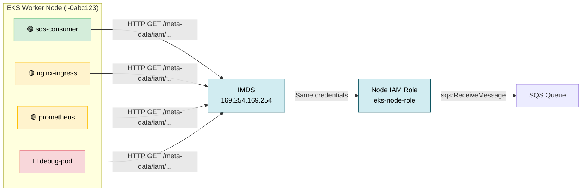
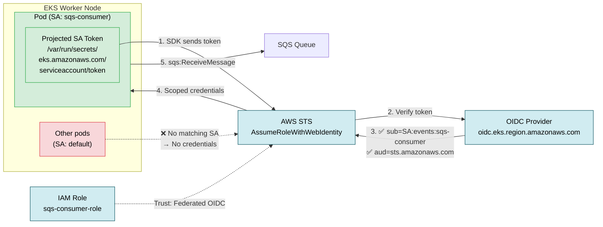
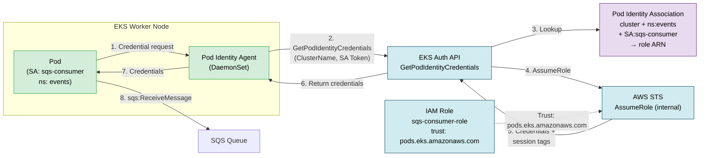

# Cross-Account SNS → SQS with IRSA — IAM Case Study

Case study thực tế: **Team A publish events qua SNS**, **Team B (chúng ta) consume qua SQS trên EKS** — cross-account, cross-region.

## Bối cảnh

```
Team A (Publisher)                    Team B — Chúng ta (Consumer)
─────────────────                    ────────────────────────────

Staging:                              Staging:
  Account: 111111111111                 Account: 333333333333
  Region:  us-west-2                    Region:  ap-southeast-1
  SNS:     events-stg                   SQS:     events-stg
                                        EKS:     consumer pods

Production:                           Production:
  Account: 222222222222                 Account: 444444444444
  Region:  us-west-2                    Region:  us-west-2  (produs) → SQS events-produs
  SNS:     events-prod                  Region:  eu-north-1 (prodeu) → SQS events-prodeu
                                        EKS:     consumer pods (cả 2 region)
```

**Pattern:** 1 SNS Topic → fan-out → N SQS Queues (cross-account, cross-region)

---

## Architecture Diagram



---

## IAM Resources cần tạo (từ góc nhìn Team B)

### Tổng quan resource theo vai trò

| # | Resource | Ai tạo | Mục đích |
|---|----------|--------|----------|
| 1 | `aws_sns_topic` | Team A | SNS topic để publish events |
| 2 | `aws_sns_topic_policy` | Team A | Cho phép Team B account subscribe |
| 3 | `aws_sqs_queue` | **Team B** | Queue nhận messages |
| 4 | `aws_sqs_queue` (DLQ) | **Team B** | Dead Letter Queue cho messages fail |
| 5 | `aws_sqs_queue_policy` | **Team B** | Cho phép SNS gửi message vào SQS |
| 6 | `aws_sns_topic_subscription` | **Team B** | Đăng ký SQS subscribe SNS topic |
| 7 | `aws_iam_openid_connect_provider` | **Team B** | OIDC provider cho EKS cluster |
| 8 | `aws_iam_role` | **Team B** | IRSA role cho consumer pods |
| 9 | `aws_iam_policy` | **Team B** | SQS read/delete permissions |
| 10 | `aws_iam_role_policy_attachment` | **Team B** | Gắn policy vào role |

### Chi tiết từng IAM Policy

#### SNS Topic Policy (Team A tạo, cho phép Team B subscribe)

```json
{
  "Effect": "Allow",
  "Principal": { "AWS": "arn:aws:iam::TEAM_B_ACCOUNT:root" },
  "Action": ["sns:Subscribe", "sns:Receive"],
  "Resource": "arn:aws:sns:us-west-2:TEAM_A_ACCOUNT:events-*"
}
```

**Tại sao cần?** SNS mặc định chỉ cho phép cùng account subscribe. Cross-account cần explicit topic policy.

#### SQS Queue Policy (Team B tạo, cho phép SNS gửi message)

```json
{
  "Effect": "Allow",
  "Principal": { "Service": "sns.amazonaws.com" },
  "Action": "sqs:SendMessage",
  "Resource": "arn:aws:sqs:REGION:TEAM_B_ACCOUNT:events-*",
  "Condition": {
    "ArnEquals": {
      "aws:SourceArn": "arn:aws:sns:us-west-2:TEAM_A_ACCOUNT:events-*"
    }
  }
}
```

**Tại sao Condition?** Không dùng condition = bất kỳ SNS topic nào cũng gửi được vào queue. `ArnEquals` lock đúng topic của Team A.

#### IRSA Trust Policy (cho EKS pods assume role)

```json
{
  "Effect": "Allow",
  "Principal": {
    "Federated": "arn:aws:iam::ACCOUNT:oidc-provider/oidc.eks.REGION.amazonaws.com/id/CLUSTER_ID"
  },
  "Action": "sts:AssumeRoleWithWebIdentity",
  "Condition": {
    "StringEquals": {
      "OIDC_URL:sub": "system:serviceaccount:NAMESPACE:SERVICE_ACCOUNT",
      "OIDC_URL:aud": "sts.amazonaws.com"
    }
  }
}
```

**Tại sao 2 conditions?**
- `:sub` = chỉ ServiceAccount cụ thể trong namespace cụ thể mới assume được
- `:aud` = chỉ chấp nhận token issued cho STS (prevent token reuse)

#### SQS Consumer Policy (permissions cho pods)

```json
{
  "Effect": "Allow",
  "Action": [
    "sqs:ReceiveMessage",
    "sqs:DeleteMessage",
    "sqs:GetQueueAttributes",
    "sqs:GetQueueUrl",
    "sqs:ChangeMessageVisibility"
  ],
  "Resource": ["arn:aws:sqs:REGION:ACCOUNT:events-*"]
}
```

**Least privilege:** Không cho `sqs:*` — chỉ 5 actions cần thiết cho consumer pattern.

---

## Message Flow

```
1. Team A app publishes event → SNS Topic (us-west-2)
2. SNS fan-out → delivers to all subscribed SQS queues
3. SQS queue (ap-southeast-1 hoặc eu-north-1) nhận message
4. EKS pod long-polls SQS (ReceiveMessage, wait 20s)
5. Pod processes message
6. Pod deletes message (DeleteMessage)
7. Nếu pod crash/timeout → message quay lại queue (visibility timeout)
8. Sau 3 lần fail → message chuyển vào DLQ
```

### Cross-Region Behavior

| Path | Latency | Behavior |
|------|---------|----------|
| SNS us-west-2 → SQS us-west-2 | ~ms | Same-region, fastest |
| SNS us-west-2 → SQS ap-southeast-1 | ~100-200ms | Cross-region, AWS backbone |
| SNS us-west-2 → SQS eu-north-1 | ~100-200ms | Cross-region, AWS backbone |

SNS handles cross-region delivery automatically — không cần VPC peering hay Transit Gateway.

---

## Project Structure

```
iam/
├── README.md              ← Tài liệu này
├── stg/                   ← Staging environment
│   ├── providers.tf       # 2 providers: default (Team B) + team_a
│   ├── variables.tf       # Account IDs, names, OIDC config
│   ├── main.tf            # 10 resources
│   └── outputs.tf         # ARNs, URLs, ServiceAccount annotation
└── prod/                  ← Production environment
    ├── providers.tf       # 3 providers: default (produs) + eu + team_a
    ├── variables.tf       # Account IDs, 2 regions, 2 OIDC configs
    ├── main.tf            # 15 resources
    └── outputs.tf         # ARNs for both regions
```

### Resource Count

| Environment | SNS | SQS | SQS Policy | Subscription | IAM OIDC | IAM Role | IAM Policy | Attachment | Total |
|-------------|-----|-----|------------|--------------|----------|----------|------------|------------|-------|
| **stg** | 1 topic + 1 policy | 2 (main + DLQ) | 1 | 1 | 1 | 1 | 1 | 1 | **10** |
| **prod** | 1 topic + 1 policy | 4 (2 main + 2 DLQ) | 2 | 2 | 2 | 1 | 1 | 1 | **15** |

---

## Quick Start

```bash
# 1. Start MiniStack
docker compose up -d

# 2. Test Staging
cd iam/stg
terraform init
terraform apply -auto-approve
terraform output
terraform destroy -auto-approve

# 3. Test Production
cd ../prod
terraform init
terraform apply -auto-approve
terraform output
terraform destroy -auto-approve

# 4. Stop MiniStack
docker compose down -v
```

---

## MiniStack Compatibility

| Service | Supported | Used for |
|---------|-----------|----------|
| SNS | ✅ | Topic, Topic Policy, Subscription |
| SQS | ✅ | Queue, DLQ, Queue Policy |
| IAM | ✅ | Role, Policy, OIDC Provider, Attachment |
| STS | ✅ | AssumeRoleWithWebIdentity (IRSA concept) |

> **Note:** MiniStack không enforce IAM policies thực sự — policies được lưu và validate cú pháp nhưng không block/allow requests. Đây là lab để học cấu trúc IAM, không phải test enforcement.

---

## Kubernetes ServiceAccount Configuration

Sau khi Terraform apply, lấy annotation từ output để cấu hình IRSA:

```yaml
apiVersion: v1
kind: ServiceAccount
metadata:
  name: sqs-consumer
  namespace: events
  annotations:
    eks.amazonaws.com/role-arn: arn:aws:iam::444444444444:role/sqs-consumer-prod-role
```

```yaml
apiVersion: apps/v1
kind: Deployment
metadata:
  name: sqs-consumer
  namespace: events
spec:
  template:
    spec:
      serviceAccountName: sqs-consumer
      containers:
        - name: consumer
          env:
            - name: SQS_QUEUE_URL
              value: "https://sqs.us-west-2.amazonaws.com/444444444444/events-produs"
            - name: AWS_DEFAULT_REGION
              value: "us-west-2"
```

---

## So sánh Staging vs Production

| Aspect | Staging | Production |
|--------|---------|------------|
| Team A Account | 111111111111 | 222222222222 |
| Team B Account | 333333333333 | 444444444444 |
| SNS Region | us-west-2 | us-west-2 |
| SQS Regions | ap-southeast-1 | us-west-2 + eu-north-1 |
| Cross-region? | Yes (SNS→SQS) | Yes (SNS→SQS eu-north-1) |
| Cross-account? | Yes | Yes |
| # SQS queues | 1 | 2 (fan-out) |
| # EKS clusters | 1 | 2 |
| IRSA OIDC trusts | 1 | 2 (dual-region) |
| Total resources | 10 | 15 |

---

## Thực tế vs Lab

| Khác biệt | Thực tế (Real AWS) | Lab (MiniStack) |
|------------|-------------------|-----------------|
| Account ID | Mỗi team có account riêng | Tất cả dùng `000000000000` |
| Cross-account | Cần explicit resource policies | MiniStack không enforce |
| IRSA | EKS OIDC Provider thực | Placeholder OIDC URL |
| Encryption | SQS KMS encryption | Không bắt buộc trên emulator |
| Region latency | Thực sự khác nhau | Tất cả local |
| IAM enforcement | Policies block/allow | Policies stored only |

**Giá trị của lab:** Học đúng **cấu trúc** IAM policies, resource relationships, và Terraform patterns — áp dụng trực tiếp khi deploy lên AWS thật.

---

## Deep Dive: 3 cách cấp quyền AWS cho EKS Pods

EKS có 3 pattern để pods gọi AWS APIs. Mỗi cách khác nhau về security, complexity, và use case phù hợp.

### Pattern 1: Node Role (Instance Profile)



> 🚨 **Blast radius = toàn bộ node.** Mọi pod (kể cả attacker exec vào debug-pod) đều lấy được credentials của Node Role.

**Cách hoạt động:**
1. EKS worker node (EC2) có Instance Profile gắn IAM Role
2. Mọi pod trên node đều truy cập được Instance Metadata Service (IMDS)
3. AWS SDK trong pod gọi IMDS (`169.254.169.254`) → lấy temporary credentials của Node Role
4. Pod dùng credentials đó gọi AWS APIs

**Credential flow:**
```
Pod (any pod on node)
  → HTTP GET http://169.254.169.254/latest/meta-data/iam/security-credentials/
  → IMDS trả về: AccessKeyId, SecretAccessKey, Token (của Node Role)
  → Pod dùng credentials gọi SQS/S3/...
```

**Terraform (Node Role):**
```hcl
# IAM Role cho EKS Node Group
resource "aws_iam_role" "eks_node" {
  name = "eks-node-role"
  assume_role_policy = jsonencode({
    Version = "2012-10-17"
    Statement = [{
      Effect    = "Allow"
      Principal = { Service = "ec2.amazonaws.com" }
      Action    = "sts:AssumeRole"
    }]
  })
}

# Gắn SQS policy trực tiếp vào Node Role
resource "aws_iam_role_policy_attachment" "node_sqs" {
  role       = aws_iam_role.eks_node.name
  policy_arn = aws_iam_policy.sqs_consumer.arn
}

# aws_iam_policy.sqs_consumer = policy cho phép ReceiveMessage, DeleteMessage, ...
# → MỌI pod trên node đều có quyền này
```

**Vấn đề:**
```
Worker Node (i-0abc123, role: eks-node-role)
  ├── sqs-consumer     ← CẦN quyền SQS  ✅
  ├── nginx-ingress    ← KHÔNG cần SQS   ⚠️  nhưng CÓ quyền
  ├── prometheus        ← KHÔNG cần SQS   ⚠️  nhưng CÓ quyền
  ├── cert-manager     ← KHÔNG cần SQS   ⚠️  nhưng CÓ quyền
  └── debug-pod (exec) ← KHÔNG cần SQS   🚨 attacker có quyền SQS
```

**Cross-account với Node Role:**
```hcl
# Team A (SNS account) phải trust TOÀN BỘ Node Role
# → Bất kỳ pod nào trên node đều assume được
resource "aws_iam_role" "cross_account" {
  assume_role_policy = jsonencode({
    Statement = [{
      Effect    = "Allow"
      Principal = { AWS = "arn:aws:iam::444444444444:role/eks-node-role" }
      Action    = "sts:AssumeRole"
    }]
  })
}
```

---

### Pattern 2: IRSA (IAM Roles for Service Accounts)

> Đây là pattern được implement trong case study `iam/stg/` và `iam/prod/`.



> ✅ **Chỉ pod có đúng ServiceAccount mới lấy được credentials.** Các pod khác trên cùng node không access được.

**Cách hoạt động:**
1. EKS cluster có OIDC Provider (mỗi cluster 1 URL unique)
2. IAM Role trust Federated principal = OIDC Provider ARN
3. Pod được assign ServiceAccount có annotation `eks.amazonaws.com/role-arn`
4. EKS mutating webhook inject projected service account token vào pod
5. AWS SDK dùng token này gọi `sts:AssumeRoleWithWebIdentity` → lấy credentials riêng

**Credential flow:**
```
Pod (ServiceAccount: sqs-consumer, namespace: events)
  → Mounted token tại /var/run/secrets/eks.amazonaws.com/serviceaccount/token
  → AWS SDK detect token (via AWS_WEB_IDENTITY_TOKEN_FILE env var)
  → SDK gọi STS: AssumeRoleWithWebIdentity(
      RoleArn: arn:aws:iam::444444444444:role/sqs-consumer-role,
      WebIdentityToken: <projected SA token>
    )
  → STS verify token với OIDC Provider:
      ✓ Token issuer = cluster OIDC URL
      ✓ sub = system:serviceaccount:events:sqs-consumer
      ✓ aud = sts.amazonaws.com
  → STS trả về temporary credentials (scoped cho role này)
  → Pod dùng credentials gọi SQS
```

**Terraform (đang dùng trong `iam/stg/main.tf`):**
```hcl
# 1. OIDC Provider — đăng ký EKS cluster identity với IAM
resource "aws_iam_openid_connect_provider" "eks" {
  url             = "https://oidc.eks.ap-southeast-1.amazonaws.com/id/EXAMPLED539D..."
  client_id_list  = ["sts.amazonaws.com"]
  thumbprint_list = ["9e99a48a9960b14926bb7f3b02e22da2b0ab7280"]
}

# 2. IAM Role — trust CHỈ đúng ServiceAccount trong đúng namespace
resource "aws_iam_role" "sqs_consumer" {
  name               = "sqs-consumer-role"
  assume_role_policy = data.aws_iam_policy_document.irsa_trust.json
}

data "aws_iam_policy_document" "irsa_trust" {
  statement {
    effect = "Allow"
    principals {
      type        = "Federated"
      identifiers = [aws_iam_openid_connect_provider.eks.arn]
    }
    actions = ["sts:AssumeRoleWithWebIdentity"]

    condition {
      test     = "StringEquals"
      variable = "${var.eks_oidc_provider_url}:sub"
      values   = ["system:serviceaccount:events:sqs-consumer"]
      #           ↑ namespace:events ↑ SA:sqs-consumer — chỉ pod này mới assume được
    }
    condition {
      test     = "StringEquals"
      variable = "${var.eks_oidc_provider_url}:aud"
      values   = ["sts.amazonaws.com"]
    }
  }
}
```

**Kết quả — chỉ đúng pod được cấp quyền:**
```
Worker Node (i-0abc123)
  ├── sqs-consumer (SA: sqs-consumer) ← CÓ quyền SQS  ✅
  ├── nginx-ingress (SA: ingress)     ← KHÔNG có quyền ✅
  ├── prometheus (SA: prometheus)      ← KHÔNG có quyền ✅
  └── debug-pod (SA: default)         ← KHÔNG có quyền ✅
```

**Hạn chế của IRSA:**

| Hạn chế | Chi tiết |
|---------|----------|
| OIDC URL coupling | Trust policy chứa OIDC URL cụ thể → thay cluster = phải sửa IAM |
| Multi-cluster scale | N clusters = N OIDC URLs trong trust policy |
| Cross-account phức tạp | Account B phải tạo OIDC Provider, Account A phải trust exact OIDC ARN |
| Không có session tags | CloudTrail log không auto-tag cluster/namespace info |
| Token refresh | SDK phải tự handle token rotation (~12h expiry) |

**Cross-account IRSA (prod dual-region, `iam/prod/main.tf`):**
```hcl
# Trust policy phải list TẤT CẢ OIDC URLs → thêm cluster = sửa IAM role
data "aws_iam_policy_document" "irsa_trust" {
  # Trust cluster us-west-2
  statement {
    principals {
      type        = "Federated"
      identifiers = [aws_iam_openid_connect_provider.eks_us.arn]
    }
    # ... conditions with OIDC URL us-west-2
  }
  # Trust cluster eu-north-1
  statement {
    principals {
      type        = "Federated"
      identifiers = [aws_iam_openid_connect_provider.eks_eu.arn]
    }
    # ... conditions with OIDC URL eu-north-1
  }
  # Thêm cluster thứ 3? → PHẢI sửa trust policy, thêm statement thứ 3
}
```

---

### Pattern 3: EKS Pod Identity (Recommended — EKS ≥ 1.24, Add-on required)

> AWS ra mắt re:Invent 2023. Replacement chính thức cho IRSA.



> ✅ **Trust principal cố định** (`pods.eks.amazonaws.com`). Thêm cluster mới chỉ cần tạo Association, **không sửa IAM Role**.
> Session tags tự động: `eks-cluster-name`, `kubernetes-namespace`, `kubernetes-service-account` → dùng cho ABAC policies.

**Cách hoạt động:**
1. Install EKS Pod Identity Agent add-on (DaemonSet chạy trên mỗi node)
2. Tạo IAM Role trust `pods.eks.amazonaws.com` (service principal cố định)
3. Tạo Pod Identity Association: cluster + namespace + SA → IAM Role
4. Pod Identity Agent intercept credential requests từ pods
5. Agent gọi EKS Auth API → trả về credentials cho đúng role

**Credential flow:**
```
Pod (ServiceAccount: sqs-consumer, namespace: events)
  → AWS SDK gọi credential endpoint (container credential provider)
  → Pod Identity Agent (DaemonSet, chạy trên node) intercept request
  → Agent gọi EKS Auth API: GetPodIdentityCredentials(
      ClusterName, ServiceAccountToken
    )
  → EKS Auth verify:
      ✓ Pod Identity Association tồn tại cho namespace:events + SA:sqs-consumer
      ✓ Token hợp lệ
  → EKS Auth gọi STS AssumeRole internally
  → Trả về credentials + session tags:
      eks-cluster-arn     = arn:aws:eks:us-west-2:444444444444:cluster/my-cluster
      eks-cluster-name    = my-cluster
      kubernetes-namespace = events
      kubernetes-service-account = sqs-consumer
  → Pod dùng credentials gọi SQS
```

**Terraform (Pod Identity):**
```hcl
# 1. IAM Role — trust service principal CỐ ĐỊNH, không phụ thuộc cluster
resource "aws_iam_role" "sqs_consumer" {
  name = "sqs-consumer-role"
  assume_role_policy = jsonencode({
    Version = "2012-10-17"
    Statement = [{
      Effect    = "Allow"
      Principal = { Service = "pods.eks.amazonaws.com" }
      Action    = ["sts:AssumeRole", "sts:TagSession"]
      # sts:TagSession bắt buộc — Pod Identity inject session tags
    }]
  })
}

# 2. Gắn SQS policy (giống IRSA)
resource "aws_iam_role_policy_attachment" "sqs_consumer" {
  role       = aws_iam_role.sqs_consumer.name
  policy_arn = aws_iam_policy.sqs_consumer.arn
}

# 3. Pod Identity Association — mapping SA → Role
resource "aws_eks_pod_identity_association" "sqs_consumer" {
  cluster_name    = "my-cluster"
  namespace       = "events"
  service_account = "sqs-consumer"
  role_arn        = aws_iam_role.sqs_consumer.arn
}
# → Thêm cluster thứ 2? Chỉ tạo thêm association, KHÔNG sửa IAM role
```

**So với IRSA — không cần:**
```hcl
# KHÔNG cần tạo OIDC Provider ✂️
# resource "aws_iam_openid_connect_provider" "eks" { ... }

# KHÔNG cần OIDC URL trong trust policy ✂️
# condition { variable = "${oidc_url}:sub" ... }

# KHÔNG cần biết OIDC thumbprint ✂️
# thumbprint_list = ["9e99a..."]
```

**Cross-account với Pod Identity:**
```hcl
# Team B (consumer account 444444444444) tạo role
resource "aws_iam_role" "sqs_consumer" {
  assume_role_policy = jsonencode({
    Statement = [{
      Effect    = "Allow"
      Principal = { Service = "pods.eks.amazonaws.com" }
      Action    = ["sts:AssumeRole", "sts:TagSession"]
      Condition = {
        StringEquals = {
          "aws:SourceAccount" = "444444444444"
          # Lock down: chỉ pods từ account này
        }
        ArnLike = {
          "aws:SourceArn" = "arn:aws:eks:*:444444444444:cluster/*"
          # Optional: restrict theo cluster ARN pattern
        }
      }
    }]
  })
}

# Association — mỗi cluster tạo 1 cái, role KHÔNG ĐỔI
resource "aws_eks_pod_identity_association" "produs" {
  cluster_name    = "eks-produs"
  namespace       = "events"
  service_account = "sqs-consumer"
  role_arn        = aws_iam_role.sqs_consumer.arn
}

resource "aws_eks_pod_identity_association" "prodeu" {
  cluster_name    = "eks-prodeu"
  namespace       = "events"
  service_account = "sqs-consumer"
  role_arn        = aws_iam_role.sqs_consumer.arn
}

# Thêm cluster thứ 3 (prodap)?
# → Chỉ thêm 1 association, IAM role KHÔNG thay đổi
```

**ABAC — viết policy theo tags (chỉ Pod Identity có):**
```hcl
# 1 policy dùng cho TẤT CẢ environments, scope tự động theo namespace
data "aws_iam_policy_document" "sqs_consumer" {
  statement {
    effect = "Allow"
    actions = [
      "sqs:ReceiveMessage",
      "sqs:DeleteMessage",
      "sqs:GetQueueAttributes",
    ]
    resources = ["arn:aws:sqs:*:444444444444:events-*"]
    condition {
      test     = "StringEquals"
      variable = "aws:PrincipalTag/kubernetes-namespace"
      values   = ["events"]
      # → Chỉ pods trong namespace "events" mới access được
      # → Pod ở namespace "default" exec vào? Có tag khác → DENIED
    }
  }
}
```

---

### Bảng so sánh tổng hợp

| Tiêu chí | Node Role | IRSA | Pod Identity |
|----------|-----------|------|-------------|
| **Granularity** | Per-node (mọi pod) | Per-ServiceAccount | Per-ServiceAccount |
| **Least privilege** | ❌ Vi phạm | ✅ | ✅ |
| **Setup complexity** | Thấp | Trung bình (OIDC setup) | Thấp (install add-on) |
| **IAM trust principal** | `ec2.amazonaws.com` | `Federated` (OIDC ARN) | `pods.eks.amazonaws.com` |
| **Credential source** | IMDS (169.254.169.254) | Projected SA token + STS | Pod Identity Agent |
| **Cross-account** | Trust Node Role ARN | Trust OIDC Provider ARN | Trust service + SourceAccount |
| **Thêm cluster mới** | Sửa trust policy | Sửa trust policy (thêm OIDC) | **Chỉ thêm association** |
| **Cluster migration** | Đổi node role → sửa trust | Đổi OIDC URL → **phải sửa trust** | **Không sửa gì** |
| **Session tags (ABAC)** | ❌ | ❌ | ✅ Auto (cluster, namespace, SA) |
| **CloudTrail audit** | Chỉ thấy node role | Thấy role, khó trace pod | Thấy role + tags (cluster, ns, SA) |
| **IMDS attack surface** | 🚨 Pod access IMDS | Pod không dùng IMDS | Pod không dùng IMDS |
| **Token lifetime** | 6h (IMDS refresh) | ~12h (projected token) | 15min–1h (configurable) |
| **EKS version** | Mọi version | ≥ 1.14 | ≥ 1.24 |
| **AWS SDK support** | Mọi version | Cần SDK hỗ trợ IRSA | Cần SDK ≥ 2023 |
| **Production recommend** | ❌ Deprecated | ✅ Vẫn OK | ✅✅ **Best practice** |

### Khi nào dùng cách nào?

| Tình huống | Recommendation |
|-----------|---------------|
| Cluster mới, EKS ≥ 1.24 | **Pod Identity** — không lý do dùng cái khác |
| Cluster cũ chưa upgrade | IRSA — vẫn tốt, upgrade lên Pod Identity khi có thể |
| Đang dùng Node Role | **Migrate ngay** — security risk, audit sẽ flag |
| Multi-cluster, multi-account | **Pod Identity** — scale tốt nhất, ít IAM changes nhất |
| Lab / learning | IRSA (case study này) — hiểu fundamental trước, Pod Identity build on top |

### Migration path: Node Role → Pod Identity

```bash
# Cluster đã có Pod Identity add-on (EKS 1.34)

# Step 1: Tạo IAM Role mới (trust pods.eks.amazonaws.com)
terraform apply  # role + policy

# Step 2: Tạo Pod Identity Association
aws eks create-pod-identity-association \
  --cluster-name my-cluster \
  --namespace events \
  --service-account sqs-consumer \
  --role-arn arn:aws:iam::444444444444:role/sqs-consumer-role

# Step 3: Restart pods để pick up credential provider mới
kubectl rollout restart deployment/sqs-consumer -n events

# Step 4: Verify
kubectl exec -n events deploy/sqs-consumer -- \
  env | grep AWS
# Expect: AWS_CONTAINER_CREDENTIALS_FULL_URI (Pod Identity)
# NOT: AWS_WEB_IDENTITY_TOKEN_FILE (IRSA)
# NOT: truy cập IMDS (Node Role)

# Step 5: Xóa SQS policy khỏi Node Role
# Chỉ xóa SAU KHI verify Pod Identity hoạt động
```

> **Lưu ý:** Case study `iam/` trong repo dùng IRSA vì MiniStack không emulate được Pod Identity Agent. Trên production EKS 1.34, dùng Pod Identity.
