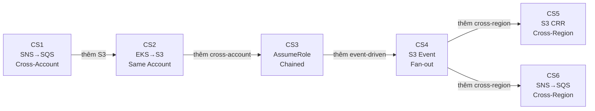

# IAM Case Studies — Enterprise AWS Patterns on MiniStack

6 case studies thực tế về IAM trên EKS, từ đơn giản đến phức tạp. Tất cả chạy được trên MiniStack (`localhost:4566`).

## Mô hình IAM chung

```
Trust policy     = "Ai vào được nhà"           (trên IAM Role — assume_role_policy)
Permission policy = "Vào nhà rồi được làm gì"    (gắn vào Role — policy attachment)
Resource policy   = "Tài nguyên có cho phép không" (trên S3/SNS/SQS/KMS — resource policy)
```

## Tổng quan

| # | Case Study | Folder | Resources | Scope | Key Concepts |
|---|---|---|:-:|---|---|
| 1 | [SNS→SQS + IRSA](stg/README.md) | `stg/`, `prod/` | 10 / 15 | Cross-account, cross-region | SNS topic policy, SQS queue policy, IRSA |
| 2 | [EKS Pod → S3](s3-eks/README.md) | `s3-eks/` | 12 | Same-account, same-region | IRSA vs Pod Identity, S3 bucket policy, ABAC |
| 3 | [Cross-Account AssumeRole](cross-account/README.md) | `cross-account/` | 14 | Cross-account | Chained AssumeRole, ExternalId, confused deputy |
| 4 | [S3 Event Fan-out](s3-events/README.md) | `s3-events/` | 20 | Same-account, event-driven | 4-layer policy chain, SNS→SQS fan-out |
| 5 | [Cross-Region S3 CRR](cross-region-s3/README.md) | `cross-region-s3/` | 21 | Same-account, **cross-region** | S3 replication IAM, multi-cluster IRSA, asymmetric RW/RO |
| 6 | [Cross-Region Pipeline](cross-region-pipeline/README.md) | `cross-region-pipeline/` | 18 | Same-account, **cross-region** | SNS cross-region delivery, multi-region SQS consumer |



## Bảng so sánh tổng hợp

| Tiêu chí | CS1 | CS2 | CS3 | CS4 | CS5 | CS6 |
|----------|:---:|:---:|:---:|:---:|:---:|:---:|
| **Accounts** | 2 | 1 | 2 | 1 | 1 | 1 |
| **Regions** | 1–2 | 1 | 1 | 1 | **2** | **2** |
| **IRSA** | ✅ | ✅ | ✅ | ✅ | ✅ (2 OIDC) | ✅ (2 OIDC) |
| **Pod Identity** | — | ✅ | ✅ | ✅ | ✅ | ✅ |
| **ABAC** | — | ✅ | — | — | ✅ | — |
| **S3 Replication** | — | — | — | — | ✅ | — |
| **ExternalId** | — | — | ✅ | — | — | — |
| **Event-driven** | — | — | — | ✅ | — | ✅ |
| **DLQ** | ✅ | — | — | ✅ | — | ✅ |
| **Policy layers** | 3 | 3 | 5 | 4 | 4 | 4 |
| **Difficulty** | ⭐⭐ | ⭐ | ⭐⭐⭐ | ⭐⭐⭐⭐ | ⭐⭐⭐ | ⭐⭐⭐⭐ |

## Quick Start

```bash
# Validate + apply any case study
cd iam/<folder>
terraform init -input=false
terraform apply -auto-approve
terraform output
terraform destroy -auto-approve
```

## MiniStack Compatibility

| Service | Supported | Notes |
|---------|:---------:|-------|
| IAM | ✅ | Roles, policies, OIDC providers — syntax validated, not enforced |
| S3 | ✅ | Buckets, versioning, encryption, policies, notifications |
| SNS | ✅ | Topics, policies, subscriptions |
| SQS | ✅ | Queues, DLQ, policies |
| STS | ✅ | AssumeRole concepts (emulated) |

> **Note:** MiniStack không enforce IAM policies thực sự — policies được lưu và validate cú pháp. Đây là lab để học **cấu trúc** IAM, không phải test enforcement.
