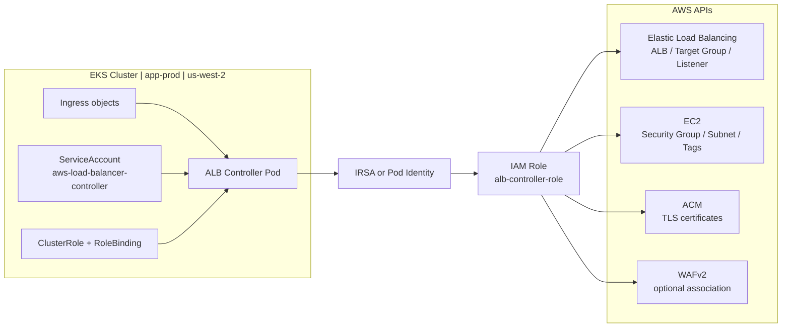
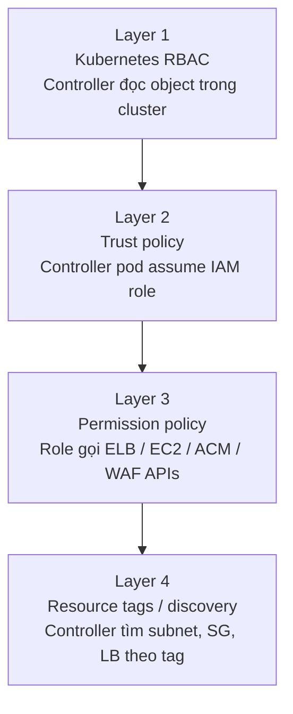
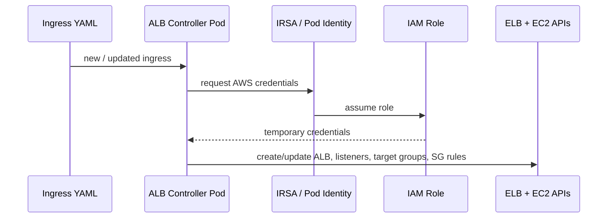
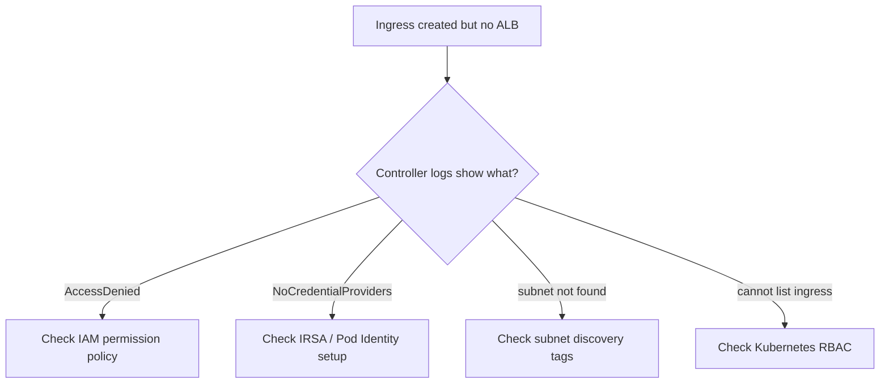

# Case Study 7 — AWS Load Balancer Controller on EKS

> **Folder:** `iam/alb-controller/` · **Lab Type:** AWS-oriented · **Scope:** Platform controller IAM

## Scenario

Platform team vận hành EKS cluster cho nhiều app teams. Ingress dùng **AWS Load Balancer Controller** để tạo ALB/NLB. Mục tiêu là tách quyền của controller khỏi node role và giải thích rõ boundary giữa **Kubernetes RBAC** và **AWS IAM**.

---

## Architecture



---

## IAM Resources

| # | Resource | Mục đích |
|---|---|---|
| 1 | ServiceAccount cho controller | Identity trong Kubernetes |
| 2 | IAM Role riêng cho controller | Tách khỏi node role |
| 3 | Trust policy | Cho IRSA hoặc Pod Identity assume role |
| 4 | Permission policy | Chỉ cho phép tạo/sửa ELB, target groups, tags, SG rules cần thiết |
| 5 | Kubernetes RBAC | Cho controller đọc Ingress, Service, Endpoint, TargetGroupBinding |

---

## Policy Layers



| Layer | Policy Type | Principal | Action | Ghi chú |
|:-----:|------------|-----------|--------|--------|
| **1** | Kubernetes RBAC | ServiceAccount | `get/list/watch` K8s resources | Không thay thế AWS IAM |
| **2** | Trust policy | OIDC / `pods.eks.amazonaws.com` | `sts:AssumeRoleWithWebIdentity` hoặc `sts:AssumeRole` | Scope chặt theo namespace + SA |
| **3** | IAM permission | Controller role | ELB/EC2/ACM/WAF actions | Tách biệt khỏi app pods |
| **4** | Discovery / tagging | AWS resources | tag-based filtering | Sai tag là controller không tìm thấy subnet/LB |

---

## Credential Flow



---

## Failure / Review Diagram



---

## Why this matters at work

- Đây là controller xuất hiện rất nhiều trong EKS production.
- Nhiều team nhét quyền ELB/EC2 vào node role, làm blast radius quá rộng.
- Case này giúp phân biệt rất rõ:
  - `Kubernetes RBAC` quyết định controller đọc gì trong cluster
  - `AWS IAM` quyết định controller tạo gì ở AWS

---

## Review Checklist

- Controller có role riêng hay đang dùng node instance profile?
- Trust policy có khóa đúng `namespace/serviceaccount` chưa?
- Permission policy có đang rộng quá mức như `elasticloadbalancing:*` không?
- Subnet discovery có phụ thuộc tag nào?
- Có tách role của controller khỏi role của app pods không?

---

## Interview Questions

- Tại sao ALB Controller cần cả Kubernetes RBAC và AWS IAM?
- Vì sao không nên dùng node role cho controller này?
- Nếu controller tạo được ALB nhưng không attach target group, bạn kiểm tra lớp nào trước?

---

## Validate

```bash
cd iam/alb-controller
terraform init -input=false
terraform apply -auto-approve
terraform output
terraform destroy -auto-approve
```

Lab này tạo **representative VPC + ALB + target group + listener** và 2 controller roles (IRSA, Pod Identity). Nó validate IAM shape và AWS resource lifecycle, không mô phỏng controller pod thật trong EKS.
