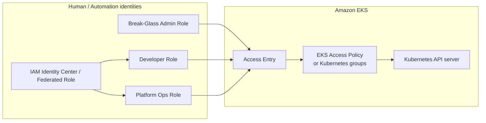
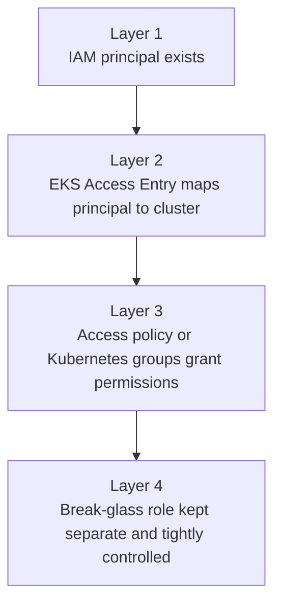
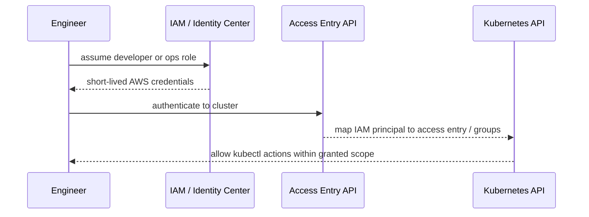
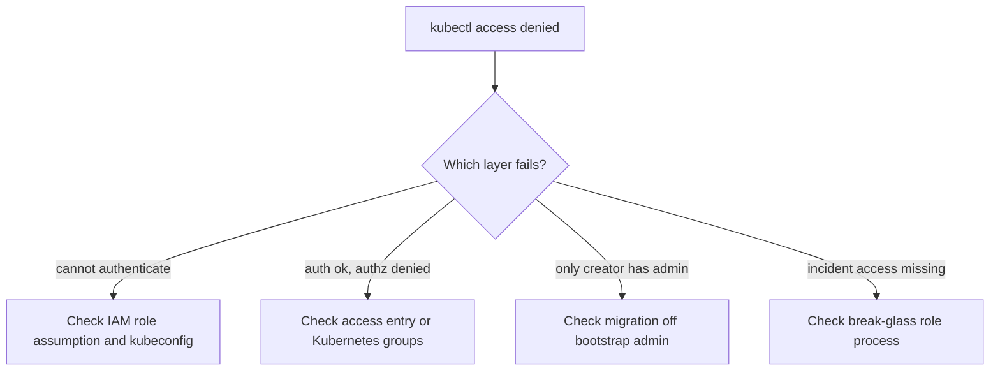

# Case Study 11 — EKS Cluster Access Entries and Break-Glass Role

> **Folder:** `iam/cluster-access/` · **Lab Type:** MiniStack runnable · **Scope:** Human access and governance

## Scenario

Team muốn bỏ dần `aws-auth` ConfigMap và quản lý quyền truy cập cluster bằng **EKS Access Entries**. Đồng thời cần giữ một **break-glass admin role** chỉ dùng trong incident, không dùng cho vận hành hàng ngày.

Case này không nói về pod access vào AWS service. Nó nói về **con người hoặc automation** vào Kubernetes API như thế nào.

---

## Architecture



---

## Policy Layers



| Layer | Policy Type | Principal | Action | Ghi chú |
|:-----:|------------|-----------|--------|--------|
| **1** | IAM federation / role trust | Human or CI identity | Assume AWS role | Nên dùng short-lived credentials |
| **2** | EKS access entry | IAM role ARN | Authenticate to cluster | Thay dần `aws-auth` |
| **3** | Access policy / RBAC | IAM role mapped to groups or access policies | Kubernetes API actions | `view`, `edit`, `admin` tách riêng |
| **4** | Break-glass controls | Admin role | emergency cluster-admin only | Không dùng hàng ngày |

---

## Access Flow



---

## Failure / Review Diagram



---

## Why this matters at work

- Nhiều cluster cũ còn lệ thuộc `aws-auth`.
- Human access và pod access thường bị trộn lẫn trong discussion, gây sai thiết kế.
- Case này buộc phân biệt:
  - ai được vào cluster
  - ai được gọi AWS service từ pod

---

## Review Checklist

- Cluster có còn phụ thuộc `aws-auth` làm nguồn auth chính không?
- Developer, platform ops, CI, break-glass có role tách riêng không?
- Cluster creator có còn permanent `cluster-admin` không?
- Break-glass role có quy trình bật/tắt và audit rõ không?
- Có dùng IAM users dài hạn thay vì federated roles không?

---

## Interview Questions

- Access Entries khác gì với `aws-auth` ConfigMap?
- Vì sao break-glass role không nên dùng cho daily operations?
- Human access vào cluster khác workload identity cho pods ở điểm nào?

---

## Validate

```bash
cd iam/cluster-access
terraform init -input=false
terraform apply -auto-approve
terraform output
terraform destroy -auto-approve
```

Mặc định lab này tạo **IAM roles + guardrail policies** cho developer, platform ops, và break-glass. `aws_eks_access_entry` được để **optional** qua biến `enable_eks_access_entries` vì support EKS control-plane trong emulator là partial.
