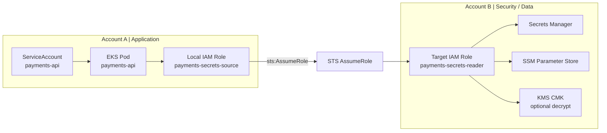
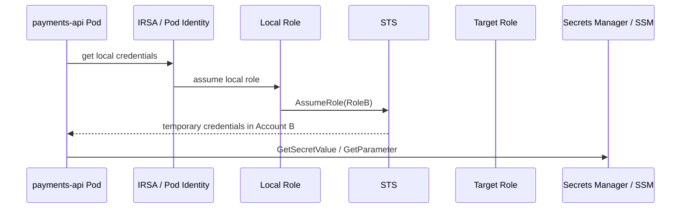
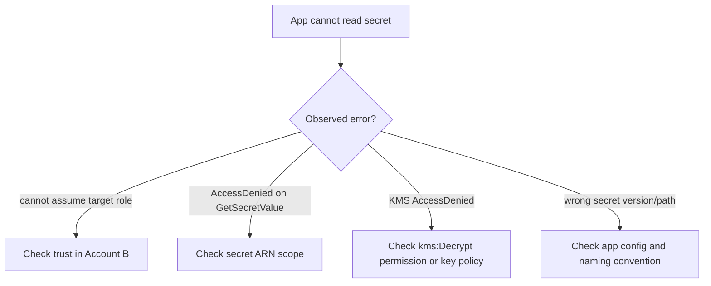

# Case Study 10 — Cross-Account Secrets Access from EKS

> **Folder:** `iam/cross-account-secrets/` · **Lab Type:** MiniStack runnable · **Scope:** App workload, cross-account

## Scenario

Ứng dụng chạy trên EKS ở **Account A** cần đọc secrets hoặc parameters ở **Security/Data Account B**. Team muốn:
- pod không có static secret
- app account không giữ quyền đọc thẳng toàn bộ secrets
- truy cập được audit rõ qua STS chain

Pattern phù hợp là: **Pod Identity hoặc IRSA ở Account A** rồi **AssumeRole** sang role đọc secret ở Account B.

---

## Architecture



---

## Policy Layers

| Layer | Policy Type | Principal | Action | Ghi chú |
|:-----:|------------|-----------|--------|--------|
| **1** | Trust A | OIDC / `pods.eks.amazonaws.com` | Assume local role | Scope đúng app SA |
| **2** | Permission A | Local role | `sts:AssumeRole` | Chỉ target role đọc secret |
| **3** | Trust B | Local role ARN | `sts:AssumeRole` | Có thể yêu cầu `sts:ExternalId` |
| **4** | Permission B | Target role | `secretsmanager:GetSecretValue`, `ssm:GetParameter*`, `kms:Decrypt` | Scope theo secret path hoặc ARN |
| **5** | Resource policy | Secret / KMS key | Target role | Allow read/decrypt | Dùng khi service hỗ trợ resource policy |

---

## Credential Flow



---

## Failure / Review Diagram



---

## Why this matters at work

- Đây là pattern rất thực tế cho microservices ở enterprise.
- Nó giải quyết cùng lúc 3 thứ:
  - không hardcode secret
  - tách account app và account bảo mật
  - audit rõ ai đọc secret, khi nào, qua role nào

---

## Review Checklist

- Local role chỉ được `AssumeRole` sang đúng target role chưa?
- Target role có scope secret theo prefix/ARN rõ chưa?
- Có cần `kms:Decrypt` không, và key policy có khớp target role không?
- Secret access là read-only hay còn write/rotate?
- Có dùng 1 role chung cho nhiều app khi lẽ ra nên tách theo app không?

---

## Interview Questions

- Tại sao không cấp thẳng `GetSecretValue` cho role ở account app?
- Vì sao KMS thường là lớp quyền bị quên trong case đọc secret?
- Nếu chuyển từ IRSA sang Pod Identity thì phần nào của flow thay đổi, phần nào không?

---

## Validate

```bash
cd iam/cross-account-secrets
terraform init -input=false
terraform apply -auto-approve
terraform output
terraform destroy -auto-approve
```

Lab này validate **cross-account IAM chain** và policy scope cho `Secrets Manager`, `SSM`, `KMS` bằng ARN-scoped IAM policies. Nó không cố tạo secret resource thật vì support matrix hiện tại của repo không công bố các API đó.
