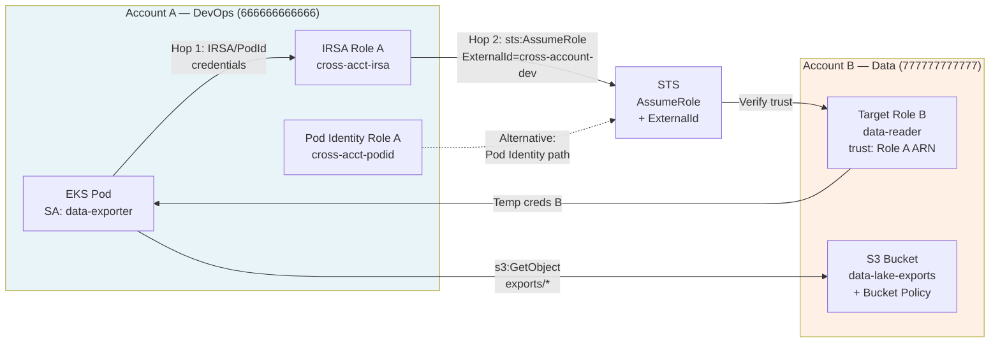
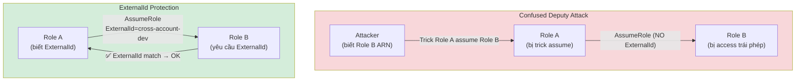

# Case Study 3 — Cross-Account AssumeRole (Chained)

> **Folder:** `iam/cross-account/` · **Resources:** 14 · **Accounts:** 666666666666 → 777777777777 · **Region:** ap-southeast-1

## Scenario

DevOps EKS pod (Account A) cần đọc S3 data lake (Account B). Pattern: **chained AssumeRole** — Pod → Role A → AssumeRole → Role B → S3.

---

## Architecture



---

## Policy Analysis (5 layers — chained)

| Layer | Location | Policy | Principal | Action | Condition |
|:-----:|----------|--------|-----------|--------|-----------|
| **Trust A** | Role A (Account A) | Trust policy | `Federated: OIDC` / `pods.eks` | `sts:AssumeRoleWithWebIdentity` / `sts:AssumeRole` | `:sub` + `:aud` |
| **Permission A** | Role A (Account A) | IAM policy | — | `sts:AssumeRole` on Role B ARN | — |
| **Trust B** | Role B (Account B) | Trust policy | `AWS: Role A ARN` | `sts:AssumeRole` | **`sts:ExternalId`** |
| **Permission B** | Role B (Account B) | IAM policy | — | `s3:GetObject` on `exports/*` | — |
| **Resource** | S3 Bucket (Account B) | Bucket policy | `AWS: Role B ARN` | `s3:GetObject, s3:ListBucket` | — |

### ExternalId — Confused Deputy Protection



**Tại sao cần ExternalId?**
- Không có ExternalId: bất kỳ ai biết Role B ARN đều có thể trick Role A assume nó
- Có ExternalId: Role B chỉ cho assume nếu caller cung cấp đúng secret string
- ExternalId là **shared secret** giữa Account A và Account B — không lưu trong code, truyền qua secure channel

---

## Credential Flow (2-hop chain)

```
Hop 1 — Pod → Role A (Account A):
  Pod (SA: data-exporter, ns: data-pipeline)
    → IRSA: SA token → STS → verify OIDC → temp credentials A
    OR
    → Pod Identity: Agent → EKS Auth → temp credentials A

Hop 2 — Role A → Role B (Account B):
  Role A credentials
    → sts:AssumeRole(
        RoleArn: arn:aws:iam::777777777777:role/data-reader-dev-role,
        ExternalId: "cross-account-dev"
      )
    → STS verify:
        ✓ Role B trust policy allows Role A ARN
        ✓ ExternalId matches
    → Temp credentials B (scoped to Account B)

Final — Access S3:
  Credentials B → s3:GetObject on data-lake-exports/exports/*
    → S3 bucket policy verify: Role B ARN allowed ✓
```

---

## So sánh IRSA vs Pod Identity (Cross-Account)

| Tiêu chí | IRSA (chained) | Pod Identity (chained) |
|----------|----------------|----------------------|
| **Hop 1 trust** | Federated OIDC | `pods.eks.amazonaws.com` |
| **Hop 2 trust** | Account B trusts Role A ARN | Account B trusts Role A ARN |
| **ExternalId** | ✅ Same | ✅ Same |
| **Cross-account audit** | CloudTrail: Role A ARN assumed Role B | CloudTrail: Role A ARN + session tags |
| **Thêm cluster assume** | Sửa OIDC trust (Hop 1) | Chỉ thêm Association |
| **Account B changes** | Không — trust Role A ARN | Không — trust Role A ARN |
| **Total IAM roles** | 2 (A + B) | 2 (A + B) |
| **Security advantage** | ExternalId prevents confused deputy | ExternalId + auto session tags |

---

## Validate

```bash
cd iam/cross-account
terraform init -input=false
terraform apply -auto-approve   # 14 resources
terraform output
```
