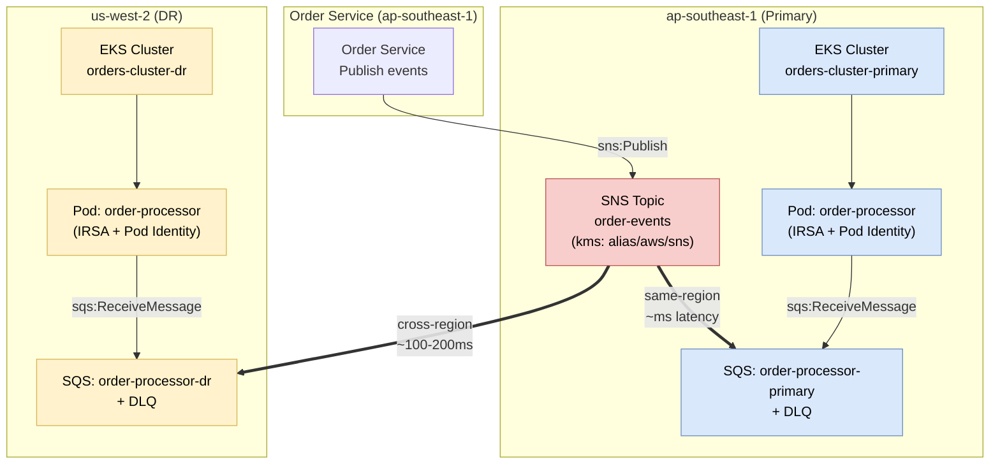
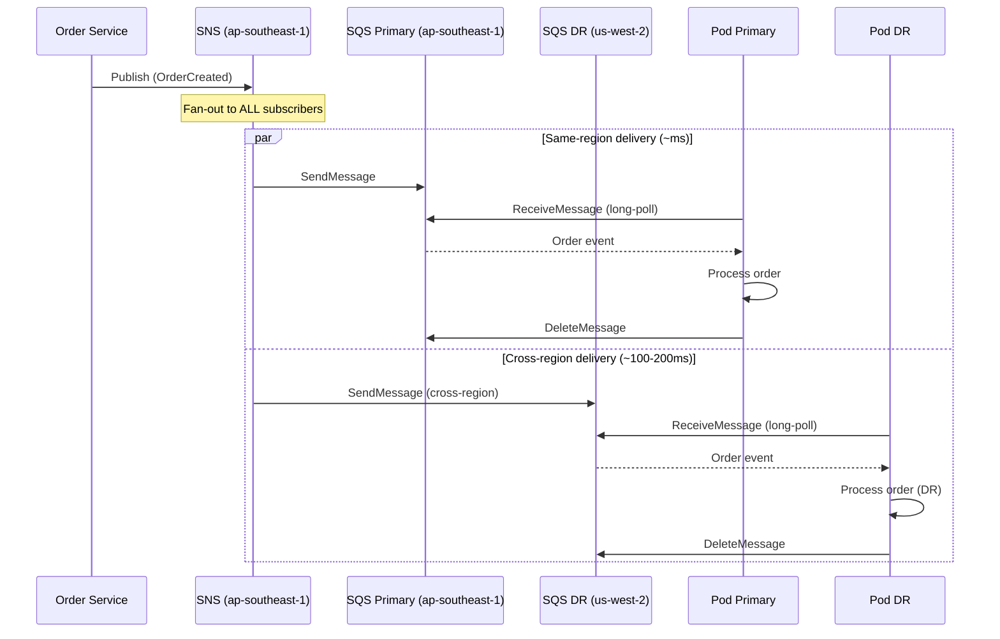
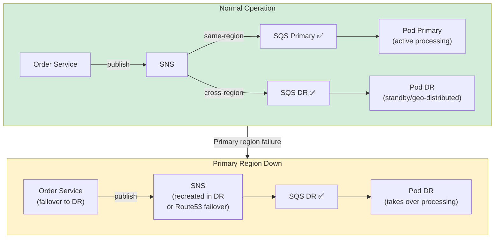

# Case Study 6 — Cross-Region Event Pipeline: SNS → SQS (Multi-Region)

> **Folder:** `iam/cross-region-pipeline/` · **Resources:** 18 · **Account:** 111111111100 · **Regions:** ap-southeast-1 (producer) + us-west-2 (DR consumer)

## Scenario

Order service ở **ap-southeast-1** publish events qua SNS. SQS consumers ở **cả 2 regions** — EKS pods ở mỗi region consume SQS queue **local** để có **low latency**. Khi primary down → DR region vẫn nhận events qua cross-region SNS delivery.

---

## Architecture



---

## Policy Analysis (4 layers)

| Layer | Resource | Policy Type | Principal | Action | Condition |
|:-----:|----------|------------|-----------|--------|-----------|
| **1** | SNS Topic | Topic Policy | `AWS: account root` | `sns:Subscribe, sns:Receive` | — |
| **2a** | SQS Primary | Queue Policy | `sns.amazonaws.com` | `sqs:SendMessage` | `ArnEquals: topic ARN` |
| **2b** | SQS DR | Queue Policy | `sns.amazonaws.com` | `sqs:SendMessage` | `ArnEquals: topic ARN` (cross-region) |
| **3** | IAM Roles | Trust | IRSA: 2 OIDC · PodId: `pods.eks` | `sts:AssumeRoleWithWebIdentity` / `sts:AssumeRole` | `:sub` + `:aud` |
| **4** | IAM Roles | Permission | — | `sqs:ReceiveMessage` + DLQ monitor | Resource ARN: **cả 2 region queues** |

### Cross-Region SNS → SQS — Cách hoạt động



**Key point:** SNS handles cross-region delivery **natively** — không cần VPC peering, Transit Gateway, hay custom routing. SQS queue policy chỉ cần allow `sns.amazonaws.com` với đúng topic ARN.

---

## So sánh Primary vs DR Region

| Aspect | Primary (ap-southeast-1) | DR (us-west-2) |
|--------|--------------------------|-----------------|
| **SNS Topic** | ✅ Có (event source) | ❌ Không có |
| **SQS Queue** | ✅ `order-processor-primary` | ✅ `order-processor-dr` |
| **DLQ** | ✅ `order-processor-primary-dlq` | ✅ `order-processor-dr-dlq` |
| **EKS Cluster** | ✅ `orders-cluster-primary` | ✅ `orders-cluster-dr` |
| **SNS → SQS latency** | ~ms (same-region) | ~100-200ms (cross-region) |
| **Processing** | Normal flow | DR / geo-distributed |

---

## So sánh IRSA vs Pod Identity (Cross-Region Pipeline)

| Tiêu chí | IRSA (multi-region) | Pod Identity (multi-region) |
|----------|--------------------|-----------------------------|
| **Trust policy** | 2 statements (1 per OIDC) | 1 statement (`pods.eks.amazonaws.com`) |
| **Thêm region thứ 3** | Thêm OIDC provider + sửa trust policy | **Chỉ thêm Association** |
| **Permission policy** | Explicit queue ARNs (2 regions) | Explicit queue ARNs (2 regions) |
| **CloudTrail** | Role ARN only | Role ARN + cluster-name + namespace + SA |
| **DR failover IAM** | Không cần thay đổi IAM | Không cần thay đổi IAM |
| **Terraform changes (add region)** | +1 OIDC provider, sửa trust, sửa permission | +1 Association, sửa permission |

### Permission Policy — Cùng role, 2 region queues

```json
{
  "Effect": "Allow",
  "Action": [
    "sqs:ReceiveMessage",
    "sqs:DeleteMessage",
    "sqs:GetQueueAttributes",
    "sqs:GetQueueUrl",
    "sqs:ChangeMessageVisibility"
  ],
  "Resource": [
    "arn:aws:sqs:ap-southeast-1:111111111100:order-processor-primary-dev",
    "arn:aws:sqs:us-west-2:111111111100:order-processor-dr-dev"
  ]
}
```

**Tại sao list cả 2 queue ARNs?**
- Pod ở primary region consume primary queue
- Pod ở DR region consume DR queue
- Cùng 1 role → cần permission cho cả 2 queue
- Nếu primary down, DR pod vẫn có permission sẵn → **zero IAM change for failover**

---

## DLQ Strategy (per region)

```
Primary region:
  order-processor-primary → fail 3x → order-processor-primary-dlq

DR region:
  order-processor-dr → fail 3x → order-processor-dr-dlq
```

| Config | Value | Why |
|--------|-------|-----|
| `maxReceiveCount` | 3 | 3 attempts |
| DLQ retention | 14 days | Investigation window |
| `visibility_timeout` | 300s (5 min) | Processing time |
| `receive_wait_time` | 20s | Long-polling |

---

## DR Failover Flow



**Zero IAM changes needed for DR failover** — Pod ở DR region đã có permission consume DR queue từ đầu.

---

## So sánh với Case Study 4 (S3 Events)

| Tiêu chí | CS4: S3 Events | CS6: Cross-Region Pipeline |
|----------|---------------|---------------------------|
| **Regions** | 1 | **2 (cross-region)** |
| **Event source** | S3 notification | Application publish |
| **SNS delivery** | Same-region only | Same-region + **cross-region** |
| **SQS queues** | 2 (processor + archiver) | 2 (primary + DR) |
| **Consumer pattern** | Different roles per queue | **Same role, both queues** |
| **DLQ** | Per consumer type | **Per region** |
| **IRSA trust** | 1 OIDC | **2 OIDC (multi-cluster)** |
| **DR capability** | ❌ | ✅ |
| **Resources** | 20 | 18 |

---

## Validate

```bash
cd iam/cross-region-pipeline
terraform init -input=false
terraform apply -auto-approve   # 18 resources
terraform output
```
