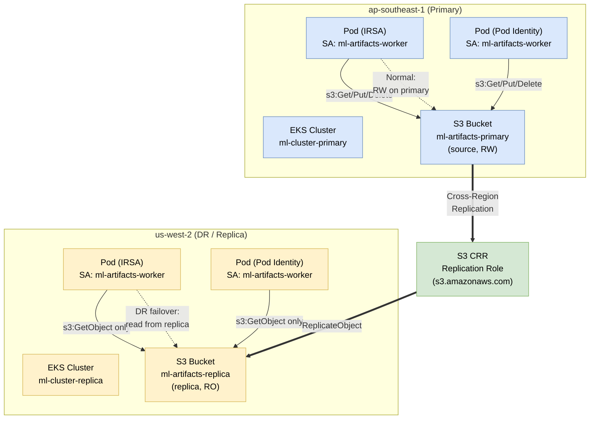
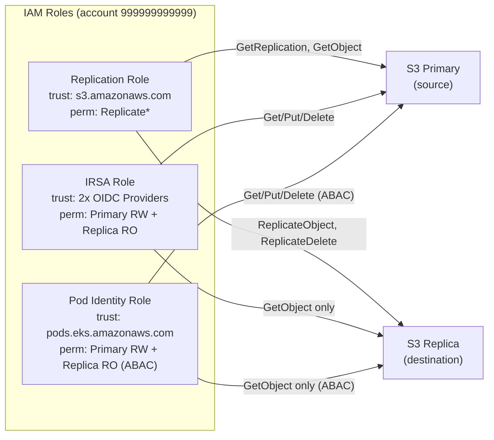
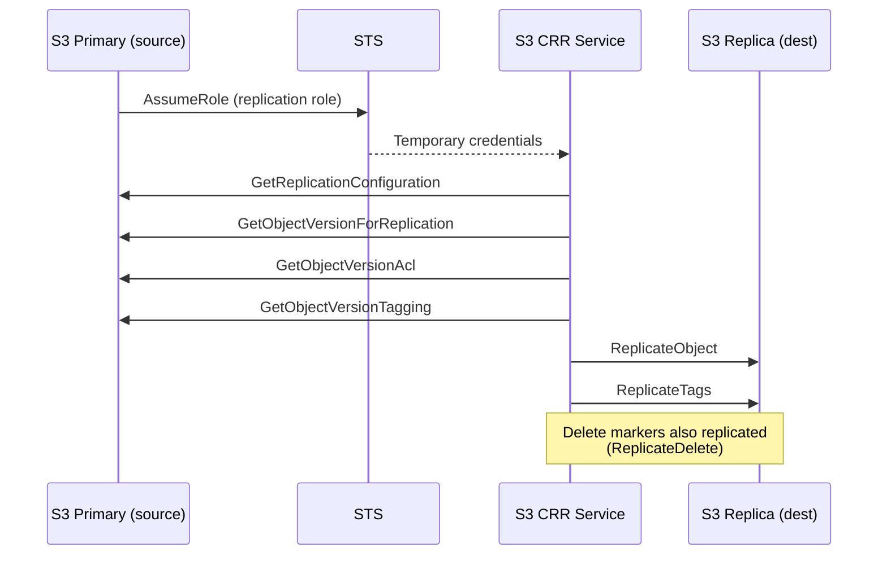

# Case Study 5 — Cross-Region S3 Replication + EKS Multi-Region Access

> **Folder:** `iam/cross-region-s3/` · **Resources:** 21 · **Account:** 999999999999 · **Regions:** ap-southeast-1 (primary) + us-west-2 (replica)

## Scenario

ML platform lưu model artifacts ở **ap-southeast-1** (primary), replicate sang **us-west-2** (DR). EKS pods ở **cả 2 regions** truy cập S3 — primary cluster **read/write**, replica cluster **read-only** (DR failover).

---

## Architecture



---

## IAM Roles — 3 loại



---

## Policy Analysis (4 layers)

| Layer | Policy | Trên resource nào | Chi tiết |
|:-----:|--------|-------------------|----------|
| **1 — Replication Trust** | Trust policy | Replication Role | `Service: s3.amazonaws.com` → `sts:AssumeRole` |
| **2 — Replication Permission** | IAM policy | Replication Role | Source: `GetReplicationConfiguration`, `GetObjectVersion*` · Dest: `ReplicateObject`, `ReplicateDelete` |
| **3 — App Trust** | Trust policy | IRSA / Pod Identity roles | IRSA: 2 OIDC providers (2 statements) · Pod Identity: `pods.eks.amazonaws.com` |
| **4 — App Permission** | IAM policy + Bucket policy | Roles + S3 buckets | **Primary: RW** (`Get/Put/Delete`) · **Replica: RO** (`GetObject` only) |

### Asymmetric Permissions — Tại sao?

```
Primary bucket (source of truth):
  ├── IRSA role:         s3:GetObject, PutObject, DeleteObject  ✅ RW
  └── Pod Identity role: s3:GetObject, PutObject, DeleteObject  ✅ RW (ABAC)

Replica bucket (DR failover):
  ├── IRSA role:         s3:GetObject                           ✅ RO
  └── Pod Identity role: s3:GetObject                           ✅ RO (ABAC)
```

**Lý do:**
- Replica bucket chỉ nhận data từ CRR — không cho app ghi trực tiếp để tránh conflict
- DR pods chỉ cần đọc artifacts đã replicate, không cần ghi
- Nếu primary down, DR cluster có thể đọc từ replica bucket mà không cần thay đổi IAM

---

## So sánh IRSA vs Pod Identity (Cross-Region)

| Tiêu chí | IRSA (multi-region) | Pod Identity (multi-region) |
|----------|--------------------|-----------------------------|
| **Trust policy** | 2 statements (1 per OIDC provider) | 1 statement (`pods.eks.amazonaws.com`) |
| **Thêm region/cluster mới** | Sửa trust policy: thêm OIDC statement | **Chỉ thêm Association** — trust không đổi |
| **Permission scope** | Hardcode namespace: `bucket/ml-platform/*` | ABAC: `bucket/${aws:PrincipalTag/kubernetes-namespace}/*` |
| **Primary vs Replica** | 4 statements (2 buckets × 2 action sets) | 4 statements (ABAC tự scope) |
| **Cluster migration** | Đổi OIDC URL → **sửa trust policy** | **Không sửa gì** |
| **CloudTrail** | Role name, khó biết từ cluster nào | Auto tags: cluster, namespace, SA |
| **Terraform resources** | OIDC × 2 + Role + Policy + Attachment = 5 | Role + Policy + Attachment = 3 |

### Scalability khi thêm Region thứ 3

**IRSA — phải sửa trust policy:**
```hcl
# Trust policy cần thêm statement thứ 3
data "aws_iam_policy_document" "irsa_trust" {
  statement { ... }  # primary
  statement { ... }  # replica
  statement { ... }  # ← THÊM MỚI: region thứ 3
}
# + Thêm OIDC provider resource
# + Sửa permission policy nếu thêm bucket
```

**Pod Identity — chỉ thêm Association:**
```hcl
# Trust policy KHÔNG ĐỔI
# Chỉ tạo thêm:
resource "aws_eks_pod_identity_association" "region3" {
  cluster_name    = "ml-cluster-region3"
  namespace       = "ml-platform"
  service_account = "ml-artifacts-worker"
  role_arn        = aws_iam_role.artifacts_pod_identity.arn
}
```

---

## S3 Replication IAM — Chi tiết



**Replication role permissions (least privilege):**

| Source Bucket | Destination Bucket |
|---|---|
| `s3:GetReplicationConfiguration` | `s3:ReplicateObject` |
| `s3:ListBucket` | `s3:ReplicateDelete` |
| `s3:GetObjectVersionForReplication` | `s3:ReplicateTags` |
| `s3:GetObjectVersionAcl` | |
| `s3:GetObjectVersionTagging` | |

---

## Validate

```bash
cd iam/cross-region-s3
terraform init -input=false
terraform apply -auto-approve   # 21 resources
terraform output
```
