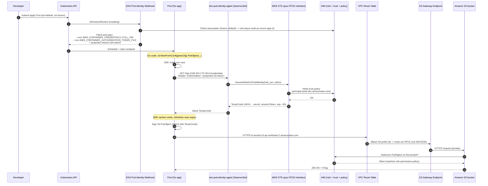

# Debug & Hiểu EKS Pod Identity → S3

> Tài liệu giải thích chi tiết cách một dòng code Go (hoặc bất kỳ AWS SDK nào) chạy trong Pod EKS lại upload được file lên S3 mà **không cần access key**, **không lộ secret**, và **không qua internet**.

---

## TL;DR

1. Bạn không gắn AccessKey vào pod.
2. EKS tự inject 2 biến môi trường vào pod khi pod's ServiceAccount có "Pod Identity Association".
3. AWS SDK trong code đọc 2 biến đó → gọi local agent → nhận temp credentials.
4. SDK ký request S3 bằng temp creds → request đi qua VPC Gateway Endpoint → tới S3 → IAM check → OK.

---

## Diagram tổng quan



---

## 9 bước chi tiết: từ code Go đến file lên S3

### Bước 1 — Bạn deploy pod (không khai báo `serviceAccountName`)

```yaml
apiVersion: apps/v1
kind: Deployment
metadata:
  namespace: fusion
spec:
  template:
    spec:
      # KHÔNG có serviceAccountName -> mặc định lấy "default"
      containers:
      - name: app
        image: my-go-app:latest
```

→ Pod thuộc namespace `fusion`, ServiceAccount `default`.

### Bước 2 — Mutating webhook intercept

EKS chạy 1 mutating admission webhook **luôn luôn được bật** kèm addon Pod Identity. Khi pod được tạo, webhook check trong AWS xem có `aws_eks_pod_identity_association` nào match cặp `(namespace=fusion, sa=default)` không.

→ Có (TF tạo): `tokyo-multi-az-mocm-app-s3` role.

Webhook patch pod spec, thêm:

```yaml
env:
- name: AWS_CONTAINER_CREDENTIALS_FULL_URI
  value: http://169.254.170.23/v1/credentials
- name: AWS_CONTAINER_AUTHORIZATION_TOKEN_FILE
  value: /var/run/secrets/pods.eks.amazonaws.com/serviceaccount/eks-pod-identity-token
volumes:
- name: eks-pod-identity-token
  projected:
    sources:
    - serviceAccountToken:
        path: eks-pod-identity-token
        expirationSeconds: 86400
        audience: pods.eks.amazonaws.com
```

Verify trong pod:
```bash
kubectl -n fusion exec <pod> -- env | grep AWS_
```

### Bước 3 — Code Go khởi tạo SDK

```go
package main

import (
    "context"
    "github.com/aws/aws-sdk-go-v2/config"
    "github.com/aws/aws-sdk-go-v2/service/s3"
)

func main() {
    cfg, _ := config.LoadDefaultConfig(context.TODO())
    client := s3.NewFromConfig(cfg)
    // ...
}
```

`config.LoadDefaultConfig` chạy **credential chain** theo thứ tự:

| Priority | Provider | Trigger |
|----------|----------|---------|
| 1 | Env keys (`AWS_ACCESS_KEY_ID`) | Có biến này — bypass tất cả |
| 2 | Shared config file (`~/.aws/credentials`) | Có file |
| 3 | **Container creds (Pod Identity / ECS)** | **Có `AWS_CONTAINER_CREDENTIALS_FULL_URI`** |
| 4 | EC2 IMDS | Fall back cuối |

→ SDK match priority 3, dùng "Container Credentials Provider".

> **Lưu ý version SDK**: cần `aws-sdk-go-v2` ≥ v1.21 (2023-08), boto3 ≥ 1.34, Java SDK v2 ≥ 2.21. SDK cũ hơn không hiểu env mới và sẽ fall back IMDS → fail.

### Bước 4 — SDK gọi local agent

SDK gửi HTTP request:

```http
GET /v1/credentials HTTP/1.1
Host: 169.254.170.23
Authorization: <nội dung file eks-pod-identity-token>
```

`169.254.170.23` là **link-local IP**, packet không rời node — đi tới process `eks-pod-identity-agent` chạy DaemonSet trên cùng node, listen `:80`.

Token là JWT do Kubernetes ký, audience `pods.eks.amazonaws.com`, có thông tin namespace + SA.

### Bước 5 — Agent gọi STS

Agent gọi:
```
sts:AssumeRoleForPodIdentity(
  RoleArn = arn:aws:iam::879891341695:role/tokyo-multi-az-mocm-app-s3,
  Token   = <SA JWT>
)
```

STS:
- Validate JWT signature (qua public key của EKS cluster issuer).
- Đọc `iss`, `sub`, `aud` từ JWT để xác định pod nào, ns nào, SA nào.
- Check **trust policy** của role:
  ```json
  {
    "Effect": "Allow",
    "Principal": {"Service": "pods.eks.amazonaws.com"},
    "Action": ["sts:AssumeRole", "sts:TagSession"]
  }
  ```
- Check **Pod Identity Association** trong AWS có map `(cluster, ns, sa)` này tới role không.
- Nếu OK → trả về temp credentials:
  ```json
  {
    "AccessKeyId": "ASIA...",
    "SecretAccessKey": "...",
    "SessionToken": "...",
    "Expiration": "2026-04-23T01:00:00Z"
  }
  ```

Default TTL: 6 giờ. Agent cache, SDK trong pod cũng cache và refresh ~5 phút trước expiry.

### Bước 6 — Code gọi S3

```go
_, err := client.PutObject(ctx, &s3.PutObjectInput{
    Bucket: aws.String("tokyo-multi-az-gears-cloud"),
    Key:    aws.String("file.txt"),
    Body:   bytes.NewReader([]byte("hello")),
})
```

SDK:
1. Lấy temp creds từ cache (đã có từ bước 5).
2. **Sign request bằng SigV4** với `SecretAccessKey` + `SessionToken`.
3. Resolve DNS `tokyo-multi-az-gears-cloud.s3.ap-northeast-2.amazonaws.com` → IP nằm trong S3 prefix-list (vd: `52.219.x.x` hoặc `3.5.x.x`).
4. Mở HTTPS connection.

### Bước 7 — VPC routing

Pod IP (vd: `10.110.45.18`) gửi packet ra IP S3. Linux kernel check route table của subnet pod đang ở:

```
Destination          Target
0.0.0.0/0            nat-gateway-xxx       (default)
pl-xxxxx (S3)        vpce-08eab16706d74a0a1  ← MATCH
```

→ Packet được gửi tới VPC Gateway Endpoint thay vì NAT. **Không qua internet, không tốn NAT data processing fee.**

Verify route:
```bash
aws ec2 describe-route-tables --route-table-id rtb-089b43d15f784f5cf
```

### Bước 8 — S3 nhận & authorize

S3 nhận request (qua VPCE):
- Verify SigV4 signature → confirm caller là role `tokyo-multi-az-mocm-app-s3`.
- Check **role's permission policy** có cho `s3:PutObject` trên `arn:aws:s3:::tokyo-multi-az-gears-cloud/file.txt` không.
- Check **bucket policy** (nếu có) — hiện tại không có.
- Check **VPCE policy** (nếu có) — hiện tại default `*`.
- Nếu pass tất cả → ghi object → return `200 + ETag`.

### Bước 9 — Response về pod

S3 → VPCE → kernel pod → SDK → code Go nhận `*s3.PutObjectOutput`. Done.

---

## Cách debug khi không upload được

### Triệu chứng A: `NoCredentialProviders: no valid providers in chain`

→ SDK không thấy env vars. Check:
```bash
kubectl -n fusion exec <pod> -- env | grep AWS_CONTAINER
```

Nếu trống:
- Pod được tạo TRƯỚC khi addon `eks-pod-identity-agent` enable → restart pod.
- ServiceAccount/namespace không match association.
  ```bash
  kubectl -n fusion get pod <pod> -o jsonpath='{.spec.serviceAccountName}'
  aws eks list-pod-identity-associations --cluster-name <cluster>
  ```
- SDK quá cũ (boto3 < 1.34, sdk-go-v2 < 1.21) → upgrade.

### Triệu chứng B: `NoSuchEntity: ... AssumeRoleForPodIdentity ...`

→ Token gửi tới agent OK nhưng STS từ chối.
- Trust policy của role không có `pods.eks.amazonaws.com` → fix `policies/pod_identity_assume_role_policy.json`.
- Association tạo cho role khác → check `terraform plan`.

### Triệu chứng C: `AccessDenied: ... s3:PutObject ...`

→ Auth thành công, nhưng IAM permission policy không cho action.
- Check role policy:
  ```bash
  aws iam get-role-policy --role-name tokyo-multi-az-mocm-app-s3 --policy-name s3-access
  ```
- Check object có nằm trong `Resource` ARN list không (typo bucket name?).
- Check action có nằm trong list không (vd: cần `PutObjectTagging` mà policy chỉ có `PutObject`).

### Triệu chứng D: `RequestTimeout` / `dial tcp ... i/o timeout`

→ Routing vấn đề.
- Check S3 prefix-list → VPCE route có không:
  ```bash
  aws ec2 describe-route-tables --filters Name=vpc-id,Values=<vpc-id> --query "RouteTables[*].Routes[?GatewayId=='vpce-08eab16706d74a0a1']"
  ```
- Check VPCE state `available`:
  ```bash
  aws ec2 describe-vpc-endpoints --vpc-endpoint-ids vpce-08eab16706d74a0a1
  ```
- Pod ở subnet không có VPCE attached → cần thêm route table của subnet đó vào VPCE.

### Triệu chứng E: `explicit deny in a resource-based policy`

→ Bucket policy hoặc VPCE policy chặn. Check:
```bash
aws s3api get-bucket-policy --bucket <bucket>
aws ec2 describe-vpc-endpoints --vpc-endpoint-ids vpce-... --query 'VpcEndpoints[0].PolicyDocument'
```

---

## Checklist verify nhanh khi recreate cluster

```bash
# 1. Addon installed
kubectl get pods -n kube-system -l app.kubernetes.io/name=eks-pod-identity-agent

# 2. Associations exist
aws eks list-pod-identity-associations --cluster-name $CLUSTER

# 3. Role + policy
aws iam get-role --role-name ${PREFIX}-mocm-app-s3
aws iam get-role-policy --role-name ${PREFIX}-mocm-app-s3 --policy-name s3-access

# 4. Test pod
kubectl run test --image=amazon/aws-cli:latest -n fusion --rm -it --restart=Never -- \
  bash -c 'aws sts get-caller-identity && aws s3 cp /etc/hostname s3://${PREFIX}-gears-cloud/test.txt'
```

Output mong đợi `Arn` chứa `assumed-role/${PREFIX}-mocm-app-s3/...` chứ KHÔNG phải `node-group`.

---

## So sánh nhanh: IRSA vs Pod Identity vs Node Role

| Khía cạnh | Node Role (cũ) | IRSA | Pod Identity (đang dùng) |
|-----------|----------------|------|--------------------------|
| Phạm vi | Mọi pod trên node | Per-SA | Per-SA (per-namespace) |
| Setup | Gắn policy vào instance role | Cần OIDC provider + annotate SA | 1 association resource |
| Trust policy | `ec2.amazonaws.com` | OIDC URL (per-cluster) | `pods.eks.amazonaws.com` (cố định) |
| Reuse role giữa nhiều cluster | Không | Khó (trust per-OIDC) | Dễ |
| Limit độ dài trust policy | N/A | Có (gặp khi nhiều SA) | Không (association là object riêng) |
| Wildcard `*` cho ns/sa | N/A | N/A | **Không support** — phải khai báo từng cặp |
| Yêu cầu SDK version | Bất kỳ | Mới (~2019) | Mới hơn (2023-08+) |

---

## File terraform liên quan

| File | Vai trò |
|------|---------|
| `terraform/aws/03.1-eks-addons.tf` | Enable addon `eks-pod-identity-agent` |
| `terraform/aws/05.1-iam-pod-identity-policies.tf` | Permission policy documents |
| `terraform/aws/05.2-iam-pod-identity-roles.tf` | IAM roles (cluster-autoscaler, ALB, EBS) |
| `terraform/aws/05.3-eks-pod-identity-associations.tf` | Associations cho 3 controller |
| `terraform/aws/05.4-mocm-app-pod-identity.tf` | Role + policy + associations cho MOCM app |
| `terraform/aws/policies/pod_identity_assume_role_policy.json` | Trust policy chung |
| `terraform/aws/01.2-vpc-endpoint.tf` | S3 Gateway Endpoint + STS Interface Endpoint |

---

## References

- [AWS docs — EKS Pod Identity](https://docs.aws.amazon.com/eks/latest/userguide/pod-identities.html)
- [AWS Blog — Amazon EKS Pod Identity (Dec 2023)](https://aws.amazon.com/blogs/aws/amazon-eks-pod-identity-simplifies-iam-permissions-for-applications-on-amazon-eks-clusters/)
- [aws-sdk-go-v2 credential providers](https://aws.github.io/aws-sdk-go-v2/docs/configuring-sdk/#specifying-credentials)

---

## Interview questions (kèm đáp án ngắn)

### Concepts

**Q1. Pod Identity khác IRSA chỗ nào?**
- IRSA: dựa trên OIDC provider của cluster; trust policy của role chứa OIDC URL → role bị "khóa" với 1 cluster cụ thể; trust policy có giới hạn 4096 ký tự nên nhiều SA bị block.
- Pod Identity: dùng principal cố định `pods.eks.amazonaws.com`; mapping `(cluster, ns, sa) → role` lưu ở **association resource** riêng → 1 role có thể reuse nhiều cluster, không giới hạn số SA.

**Q2. Pod Identity có support wildcard cho namespace/SA không?**
- Không. Phải khai báo từng cặp `(namespace, serviceAccount)` cụ thể. Đây là design choice cho rõ ràng audit.

**Q3. Vì sao IP `169.254.170.23` lại đặc biệt?**
- Là **link-local address** (RFC 3927) — packet tới IP này không bao giờ rời node. EKS dùng để pod gọi local agent qua HTTP mà không cần network policy phức tạp hay DNS lookup.

**Q4. Token mà SDK gửi tới agent là gì? Khác gì AccessKey?**
- Là **projected ServiceAccount token** (JWT) do Kubernetes ký, audience `pods.eks.amazonaws.com`, TTL ngắn (24h, auto-rotate). Đây **không phải AWS credential** — agent dùng nó để chứng minh "tôi là pod X trong ns Y với SA Z" rồi đổi lấy STS temp creds.

**Q5. Temp credentials TTL bao lâu? SDK refresh thế nào?**
- Default 6 giờ. SDK (boto3, sdk-go-v2) tự cache trong memory và gọi lại agent ~5 phút trước expiry. Pod không cần restart.

### Security

**Q6. Nếu attacker chui vào pod thì lấy được gì?**
- Lấy được **temp creds của role gắn cho ns+SA đó** (scope: chỉ S3 buckets được liệt kê + actions least-privilege). Không lấy được:
  - AccessKey vĩnh viễn (không có).
  - Quyền của pod khác (creds bị cô lập per-pod).
  - Quyền admin AWS.
- Mitigation thêm: bucket policy `aws:sourceVpce` để chống credential exfiltration ra ngoài VPC.

**Q7. Tại sao remove S3 policy khỏi node role lại quan trọng?**
- Nếu để policy ở node role: **mọi pod** trên node đó (kể cả pod hệ thống bị compromise như log shipper, sidecar bug) đều có S3 access → vi phạm least-privilege. Pod Identity giới hạn theo SA → defense in depth.

**Q8. Trust policy của role tại sao chỉ là `pods.eks.amazonaws.com` mà không cần restrict thêm?**
- Vì restriction nằm ở **association** (cluster + ns + sa). Bản thân principal `pods.eks.amazonaws.com` không tự assume được — phải qua API `AssumeRoleForPodIdentity` mà chỉ có agent của cluster có association mới gọi được.

### Networking

**Q9. Bạn chứng minh pod đi qua VPCE chứ không qua NAT bằng cách nào?**
- 3 cách:
  1. Set bucket policy `Deny if aws:sourceVpce != <id>` → test PUT từ pod (PASS) vs từ public (DENY).
  2. Tạm thời disable NAT gateway → S3 vẫn work (vì đi VPCE), internet thì không.
  3. Bật VPC Flow Logs filter `dstaddr in S3 prefix-list` → confirm packet `pkt-srcaddr` là pod IP, route via VPCE.

**Q10. Khác gì giữa Gateway Endpoint và Interface Endpoint?**
- Gateway: chỉ S3 + DynamoDB; free; routing qua route table; không có ENI; DNS không đổi.
- Interface: tất cả service khác (STS, ECR, SSM...); $7.2/AZ/month + data; có ENI trong subnet; private DNS có thể override DNS.
- Trong project: S3 dùng Gateway (free), STS dùng Interface (cần private DNS để SDK resolve `sts.region.amazonaws.com`).

**Q11. Nếu pod gọi STS, traffic đi đường nào?**
- Qua **STS Interface Endpoint** (`vpce-...sts`) vì STS không có Gateway type. Cần `private_dns_enabled = true` để SDK gọi `sts.ap-northeast-2.amazonaws.com` được resolve về private IP của ENI VPCE thay vì IP public.

### Troubleshooting

**Q12. Pod gặp `NoCredentialProviders` mặc dù đã tạo association. Debug từ đâu?**
- Thứ tự check:
  1. `kubectl exec ... env | grep AWS_CONTAINER` → nếu trống = webhook chưa inject. Thường do pod start TRƯỚC khi association được tạo, hoặc SA của pod khác `default`.
  2. `kubectl get sa -n <ns>` → đúng SA chưa.
  3. `aws eks list-pod-identity-associations` → match đúng cặp.
  4. Restart pod (không cần delete deployment).

**Q13. Pod vẫn assume được role nhưng S3 trả `AccessDenied`?**
- Phân biệt:
  - `not authorized to perform: s3:X` → permission policy thiếu action.
  - `explicit deny in a resource-based policy` → bucket policy / VPCE policy chặn.
  - `NoSuchBucket` → typo bucket name (không phải permission).
- Tools: `aws iam simulate-principal-policy --policy-source-arn <role-arn> --action-names s3:PutObject --resource-arns <bucket-arn>/key`.

**Q14. Sau khi đổi association (vd: thêm namespace mới), pod cũ có cần restart không?**
- **Pod hiện tại**: không cần — nếu pod cũ thuộc association cũ thì creds vẫn refresh OK.
- **Pod mới của ns mới**: phải tạo SAU khi association được apply (webhook check tại admission time).
- **Pod cũ của ns mới (đã chạy trước association)**: phải restart vì env vars chưa được inject.

### Architecture / Design

**Q15. Tại sao chọn cùng 1 role cho cả 2 namespace `fusion` và `mditaccess` thay vì 2 role riêng?**
- Cả 2 đều thuộc cùng app stack MOCM, dùng cùng bộ S3 buckets, cùng level trust → 1 role là đủ.
- Trade-off: nếu sau này 2 ns cần phân quyền khác nhau (vd: mditaccess chỉ read, fusion full) → tách thành 2 role + 2 association.

**Q16. Vì sao dùng `default` SA mà không tạo SA riêng kiểu `mocm-app`?**
- Vì Helm chart MOCM hiện tại không declare `serviceAccountName` trên bất kỳ pod template nào → tất cả pods inherit `default` SA của ns. Tạo SA mới sẽ cần fork chart.
- Best practice **lý tưởng**: tạo SA riêng per service và set `serviceAccountName` để principle of least privilege rõ hơn — đây là technical debt nên ghi nhận.

**Q17. Nếu cần thêm KMS encryption cho S3 thì sửa gì?**
- Bucket: bật `aws_s3_bucket_server_side_encryption_configuration` với `sse_algorithm = "aws:kms"` + `kms_key_id`.
- IAM role: thêm vào permission policy:
  ```json
  {"Effect":"Allow","Action":["kms:Decrypt","kms:GenerateDataKey"],"Resource":"<kms-key-arn>"}
  ```
- KMS key policy: cho phép principal là role ARN hoặc set `kms:ViaService = s3.region.amazonaws.com`.

**Q18. Cost của Pod Identity vs IRSA?**
- Pod Identity: free (addon free, không có ENI).
- IRSA: free.
- Cả hai đều phụ thuộc STS calls (free trong region). Cost thực tế ngang nhau.

### Edge cases

**Q19. Pod chạy `hostNetwork: true` có dùng được Pod Identity không?**
- Có nhưng cần lưu ý: agent listen trên link-local `169.254.170.23` thuộc **node namespace**. Pod hostNetwork share network với node nên access được. Nhưng nếu pod cũng share PID/IPC → bypass isolation.

**Q20. Nếu cluster bị xoá và recreate thì pod identity associations có còn không?**
- Không. Association gắn với cluster ID. Recreate cluster = mất hết association → terraform sẽ recreate. **Role IAM thì giữ nguyên** (global resource).

**Q21. Có thể giới hạn 1 association chỉ cho 1 pod cụ thể không (không phải toàn ns+SA)?**
- Không trực tiếp. Nhưng có thể đạt được bằng cách tạo SA riêng cho 1 deployment cụ thể, rồi association point tới SA đó. Granularity của Pod Identity là `(ns, sa)`, không phải pod.

**Q22. SDK Go v1 có support Pod Identity không?**
- **Không**. Chỉ aws-sdk-go-v2 từ v1.21 (2023-08) trở lên. SDK v1 sẽ fall back IMDS → lấy node role → fail nếu node role không có S3.
