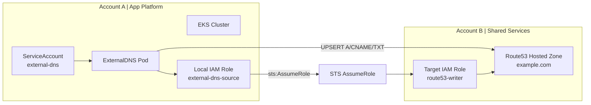
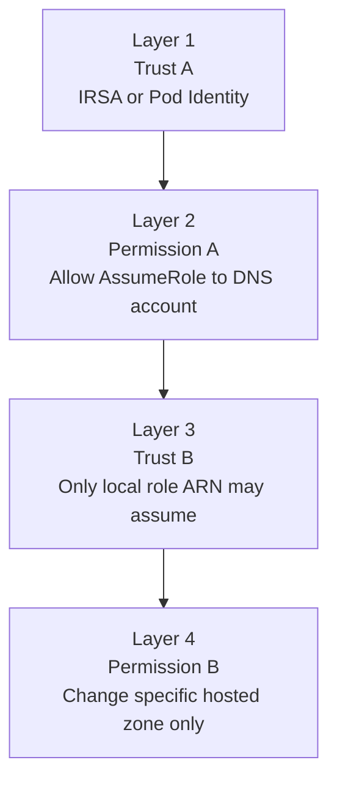
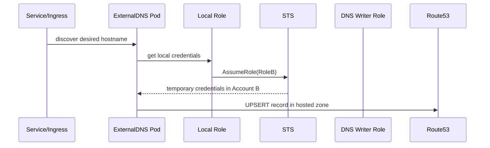
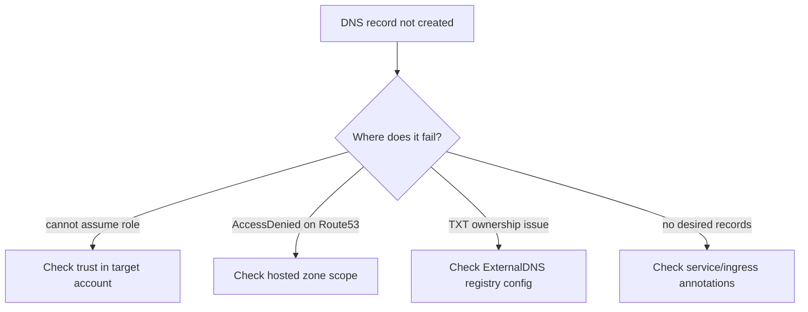

# Case Study 8 — ExternalDNS Cross-Account Route53

> **Folder:** `iam/external-dns-cross-account/` · **Lab Type:** MiniStack runnable · **Scope:** Platform, cross-account

## Scenario

App cluster nằm ở **Account A**, còn public hosted zone nằm ở **Shared Services Account B**. `ExternalDNS` chạy trong cluster phải cập nhật record trên Route53 mà không được cấp thẳng quyền DNS vào account app.

---

## Architecture



---

## Policy Layers



| Layer | Policy Type | Principal | Action | Ghi chú |
|:-----:|------------|-----------|--------|--------|
| **1** | Trust A | OIDC / `pods.eks.amazonaws.com` | Assume local role | Scope theo SA `external-dns` |
| **2** | Permission A | Local role | `sts:AssumeRole` | Chỉ target role ở DNS account |
| **3** | Trust B | Local role ARN | `sts:AssumeRole` | Có thể thêm `ExternalId` nếu nhiều tenants |
| **4** | Permission B | Target role | `route53:ChangeResourceRecordSets` | Scope đúng hosted zone ARN |

---

## Credential Flow



---

## Failure / Review Diagram



---

## Why this matters at work

- Mô hình shared-services account cho DNS rất phổ biến.
- Đây là case cực hợp để học boundary:
  - cluster/app account không nên có full DNS write
  - DNS account không nên trust toàn bộ account app
- Dễ gặp trong môi trường multi-account enterprise.

---

## Review Checklist

- Controller role local có chỉ được `sts:AssumeRole` vào đúng target role không?
- Target role có trust trực tiếp account root hay chỉ trust local role ARN?
- Route53 policy có scope đúng hosted zone ARN không?
- Có cần `ExternalId` hay condition khác để tránh confused deputy không?
- Record ownership TXT có được thiết kế rõ khi nhiều clusters cùng ghi DNS không?

---

## Interview Questions

- Tại sao ExternalDNS cross-account thường dùng chained `AssumeRole`?
- Nếu app account bị compromise, làm sao giới hạn blast radius lên DNS account?
- Tại sao hosted zone policy quá rộng là rủi ro lớn hơn nhiều so với case SQS consumer?

---

## Validate

```bash
cd iam/external-dns-cross-account
terraform init -input=false
terraform apply -auto-approve
terraform output
terraform destroy -auto-approve
```

Lab này tạo hosted zone thật trên MiniStack Route53, bootstrap TXT record, source roles ở app account, và target writer roles ở shared-services account.
