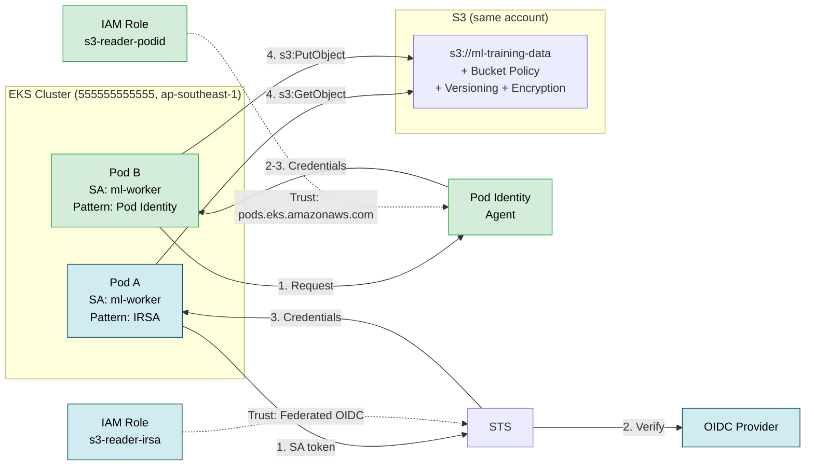

# Case Study 2 — EKS Pod → S3 (Same Account)

> **Folder:** `iam/s3-eks/` · **Resources:** 12 · **Account:** 555555555555 · **Region:** ap-southeast-1

## Scenario

ML training pod trên EKS cần đọc/ghi S3 bucket **cùng account, cùng region**. So sánh 2 pattern: **IRSA vs Pod Identity** side-by-side.

---

## Architecture



---

## Policy Analysis (3 layers)

| Layer | Policy Type | IRSA Pattern | Pod Identity Pattern |
|:-----:|------------|--------------|---------------------|
| **Trust** | `assume_role_policy` | `Federated` OIDC + `:sub` + `:aud` conditions | `Service: pods.eks.amazonaws.com` + `sts:TagSession` |
| **Permission** | `aws_iam_policy` | `s3:GetObject/PutObject` scoped to `bucket/namespace/*` | ABAC: scoped to `bucket/${aws:PrincipalTag/kubernetes-namespace}/*` |
| **Resource** | `aws_s3_bucket_policy` | Allow IRSA role ARN | Allow Pod Identity role ARN |

### Trust Policy — Chi tiết

**IRSA:**
```json
{
  "Effect": "Allow",
  "Principal": { "Federated": "arn:aws:iam::555555555555:oidc-provider/oidc.eks..." },
  "Action": "sts:AssumeRoleWithWebIdentity",
  "Condition": {
    "StringEquals": {
      "oidc.eks...:sub": "system:serviceaccount:ml-training:ml-worker",
      "oidc.eks...:aud": "sts.amazonaws.com"
    }
  }
}
```

**Pod Identity:**
```json
{
  "Effect": "Allow",
  "Principal": { "Service": "pods.eks.amazonaws.com" },
  "Action": ["sts:AssumeRole", "sts:TagSession"]
}
```

### Permission Policy — IRSA vs ABAC

**IRSA (hardcode namespace):**
```json
{
  "Action": ["s3:GetObject", "s3:PutObject"],
  "Resource": "arn:aws:s3:::ml-training-data/ml-training/*"
}
```

**Pod Identity (ABAC — auto scope by namespace tag):**
```json
{
  "Action": ["s3:GetObject", "s3:PutObject"],
  "Resource": "arn:aws:s3:::ml-training-data/${aws:PrincipalTag/kubernetes-namespace}/*"
}
```

---

## So sánh IRSA vs Pod Identity

| Tiêu chí | IRSA | Pod Identity |
|----------|------|-------------|
| **Trust principal** | `Federated` (OIDC ARN cụ thể) | `pods.eks.amazonaws.com` (cố định) |
| **Permission scope** | Hardcode namespace trong resource path | ABAC: `${aws:PrincipalTag/kubernetes-namespace}` |
| **Thêm cluster mới** | Sửa trust policy (thêm OIDC URL) | Chỉ thêm Association |
| **Thêm namespace mới** | Sửa cả trust + permission policy | Chỉ thêm Association, policy TỰ ĐỘNG scope |
| **CloudTrail audit** | Thấy role name, khó trace pod | Auto session tags: cluster, namespace, SA |
| **Setup complexity** | OIDC Provider + thumbprint | Install add-on, tạo Association |
| **S3 prefix isolation** | Manual: `ml-training/*` | Auto: `${namespace}/*` |
| **Terraform resources** | 6 (OIDC, role, trust, policy, attachment, bucket policy) | 4 (role, trust, policy, attachment) |

---

## Credential Flow — Step by Step

### IRSA

```
Pod (SA: ml-worker, ns: ml-training)
  → Mounted token tại /var/run/secrets/eks.amazonaws.com/serviceaccount/token
  → AWS SDK detect token (AWS_WEB_IDENTITY_TOKEN_FILE)
  → SDK gọi STS: AssumeRoleWithWebIdentity(RoleArn, Token)
  → STS verify token với OIDC Provider:
      ✓ Token issuer = cluster OIDC URL
      ✓ sub = system:serviceaccount:ml-training:ml-worker
      ✓ aud = sts.amazonaws.com
  → STS trả về temporary credentials (scoped)
  → Pod dùng credentials gọi S3
```

### Pod Identity

```
Pod (SA: ml-worker, ns: ml-training)
  → AWS SDK gọi container credential endpoint
  → Pod Identity Agent (DaemonSet) intercept
  → Agent gọi EKS Auth API: GetPodIdentityCredentials
  → EKS Auth verify Pod Identity Association
  → EKS Auth gọi STS AssumeRole internally
  → Trả về credentials + session tags:
      kubernetes-namespace = ml-training
      kubernetes-service-account = ml-worker
  → Pod dùng credentials gọi S3
```

---

## Validate

```bash
cd iam/s3-eks
terraform init -input=false
terraform apply -auto-approve   # 12 resources
terraform output
```
