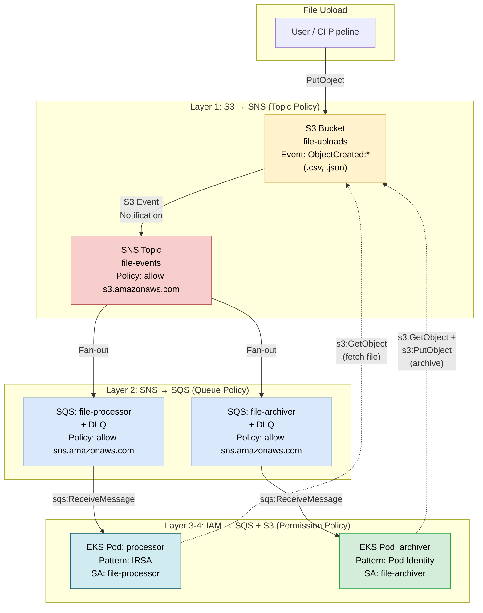
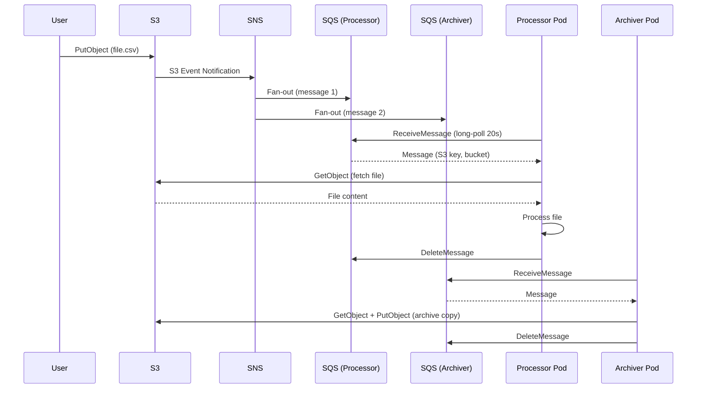

# Case Study 4 — S3 Event → SNS/SQS Fan-out (Event-Driven)

> **Folder:** `iam/s3-events/` · **Resources:** 20 · **Account:** 888888888888 · **Region:** ap-southeast-1

## Scenario

File upload → S3 event notification → SNS fan-out → 2 SQS queues. EKS pods consume: **processor (IRSA)** + **archiver (Pod Identity)**. Demonstrates 4-layer IAM policy chain in event-driven architecture.

---

## Architecture



---

## Policy Chain Analysis (4 layers)

| Layer | Resource | Policy Type | Principal | Action | Condition |
|:-----:|----------|------------|-----------|--------|-----------|
| **1** | SNS Topic | Topic Policy (resource) | `s3.amazonaws.com` | `sns:Publish` | `ArnLike: aws:SourceArn = bucket ARN` |
| **2a** | SQS Processor | Queue Policy (resource) | `sns.amazonaws.com` | `sqs:SendMessage` | `ArnEquals: aws:SourceArn = topic ARN` |
| **2b** | SQS Archiver | Queue Policy (resource) | `sns.amazonaws.com` | `sqs:SendMessage` | `ArnEquals: aws:SourceArn = topic ARN` |
| **3a** | Processor Role | Trust (IRSA) | `Federated: OIDC ARN` | `sts:AssumeRoleWithWebIdentity` | `:sub` + `:aud` |
| **3b** | Archiver Role | Trust (Pod Identity) | `pods.eks.amazonaws.com` | `sts:AssumeRole, sts:TagSession` | — |
| **4a** | Processor Role | Permission | — | `sqs:ReceiveMessage` + `s3:GetObject` | Resource ARN scoped |
| **4b** | Archiver Role | Permission | — | `sqs:ReceiveMessage` + `s3:GetObject/PutObject` | Resource ARN scoped |

### Layer-by-Layer — Tại sao cần?

**Layer 1 — S3 → SNS:** S3 notification cần SNS topic policy cho phép `s3.amazonaws.com` publish. Condition `ArnLike` lock đúng bucket cụ thể.

**Layer 2 — SNS → SQS:** Mỗi SQS queue cần queue policy cho phép `sns.amazonaws.com` send message. Condition `ArnEquals` lock đúng topic cụ thể.

**Layer 3 — Pod → Role:** Processor dùng IRSA (`:sub` + `:aud`), Archiver dùng Pod Identity (`pods.eks.amazonaws.com`).

**Layer 4 — Role → Resources:** Processor chỉ đọc SQS + S3 (`GetObject`). Archiver đọc SQS + đọc/ghi S3 (`GetObject` + `PutObject` cho archive).

---

## Event Flow



---

## So sánh Processor (IRSA) vs Archiver (Pod Identity)

| Tiêu chí | Processor (IRSA) | Archiver (Pod Identity) |
|----------|------------------|------------------------|
| **Trust** | Federated OIDC, `:sub` = `file-processor` | `pods.eks.amazonaws.com` |
| **SQS access** | `sqs:ReceiveMessage` processor queue only | `sqs:ReceiveMessage` archiver queue only |
| **S3 access** | `s3:GetObject` (read only) | `s3:GetObject + PutObject` (read + archive) |
| **Audit trail** | Role name in CloudTrail | Role + namespace + SA tags |
| **DLQ monitoring** | Processor DLQ only | Archiver DLQ only |
| **Scale to N queues** | 1 role per queue (or wildcard) | 1 role per queue + ABAC possible |

---

## DLQ Strategy

```
file-processor → fail 3x → file-processor-dlq (14 days retention)
file-archiver  → fail 3x → file-archiver-dlq  (14 days retention)
```

| Config | Value | Why |
|--------|-------|-----|
| `maxReceiveCount` | 3 | 3 attempts trước khi vào DLQ |
| `message_retention_seconds` | 1,209,600 (14 days) | DLQ giữ 14 ngày để investigate |
| `visibility_timeout_seconds` | 300 (5 min) | Cho processor đủ thời gian xử lý |
| `receive_wait_time_seconds` | 20 | Long-polling giảm empty receives |

---

## Validate

```bash
cd iam/s3-events
terraform init -input=false
terraform apply -auto-approve   # 20 resources
terraform output
```
