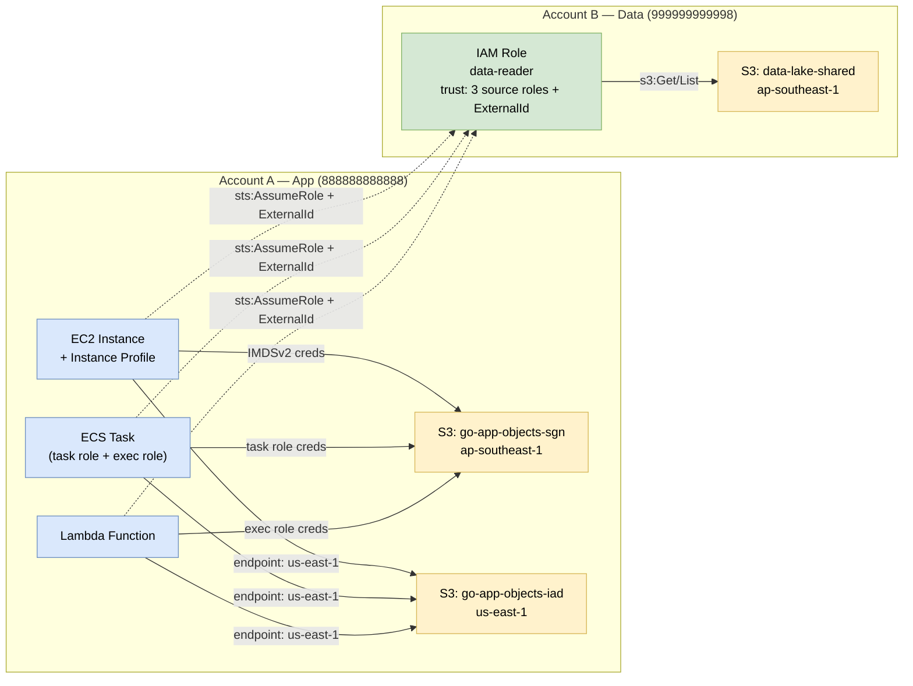
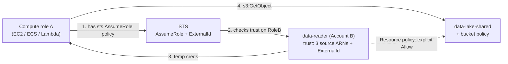

# Case Study 12 — Go BE → S3 Compute Matrix

> **Folder:** `iam/s3-go-compute-matrix/` · **Resources:** ~30 · **Accounts:** 888888888888 (App), 999999999998 (Data) · **Regions:** ap-southeast-1 + us-east-1

## Scenario

Một Go backend cần đọc/ghi S3, được deploy trên 3 loại compute (**EC2**, **ECS task**, **Lambda**) và phải truy cập 3 scope bucket:

1. **Same account + Same region** — bucket cùng Account A, cùng `ap-southeast-1`.
2. **Same account + Cross region** — bucket cùng Account A, nhưng `us-east-1`.
3. **Cross account + Same region** — bucket ở Account B, `ap-southeast-1`, qua `sts:AssumeRole` với `ExternalId`.

Mục tiêu: thấy rõ trust principal khác nhau theo compute, và shape IAM khi mở rộng cross-region / cross-account.

---

## Architecture



---

## IAM patterns — 3 trust shapes cho compute

| Compute | Trust principal | Hardening | Credential source (Go SDK) |
|---|---|---|---|
| EC2 | `Service: ec2.amazonaws.com` | Instance profile gắn vào EC2 | IMDSv2 (`config.LoadDefaultConfig`) |
| ECS task | `Service: ecs-tasks.amazonaws.com` | `aws:SourceAccount = <app account>` | `AWS_CONTAINER_CREDENTIALS_RELATIVE_URI` |
| Lambda | `Service: lambda.amazonaws.com` | Logs scope theo `/aws/lambda/<project>-*` | Env vars + STS web identity |

Cả 3 role được attach **cùng 1 permission policy** (`same_account_s3`) cho bucket same-region + cross-region trong Account A. **Cross-region không cần policy khác** — chỉ cần Go SDK gọi đúng region khi tạo client (`s3.NewFromConfig(cfg, func(o *s3.Options) { o.Region = "us-east-1" })`).

---

## Cross-account flow (3 layers)



Trust trên `data-reader` liệt kê **cả 3 ARN** + `sts:ExternalId` → bất kỳ compute nào trong Account A đều gọi được. Bucket policy (Account B) thêm 1 lớp explicit allow để pass cross-account check.

---

## Go SDK reference

```go
// Same account, same region
cfg, _ := config.LoadDefaultConfig(ctx, config.WithRegion("ap-southeast-1"))
s3.NewFromConfig(cfg).GetObject(ctx, &s3.GetObjectInput{
    Bucket: aws.String("go-app-objects-sgn"),
    Key:    aws.String("..."),
})

// Same account, cross region — chỉ đổi region trên client
crossRegion := s3.NewFromConfig(cfg, func(o *s3.Options) { o.Region = "us-east-1" })
crossRegion.GetObject(ctx, &s3.GetObjectInput{Bucket: aws.String("go-app-objects-iad"), Key: ...})

// Cross account — AssumeRole rồi tạo client mới
stsc := sts.NewFromConfig(cfg)
creds := stscreds.NewAssumeRoleProvider(stsc, "<cross_account_data_reader_arn>", func(o *stscreds.AssumeRoleOptions) {
    o.ExternalID = aws.String("go-app-2026")
})
xCfg := cfg.Copy()
xCfg.Credentials = aws.NewCredentialsCache(creds)
s3.NewFromConfig(xCfg).GetObject(ctx, &s3.GetObjectInput{Bucket: aws.String("data-lake-shared"), Key: ...})
```

---

## Failure / Review checklist

- EC2 không thấy creds → quên gán **instance profile** (chứ không phải role).
- ECS task gọi S3 401 → nhầm **exec role** với **task role**.
- Lambda timeout khi gọi S3 cross-region → quên override region trên client (`config.WithRegion` chỉ ảnh hưởng STS endpoint).
- Cross-account `AccessDenied` → check theo thứ tự: trust policy RoleB → permission RoleB → bucket policy → ExternalId → KMS key policy (nếu SSE-KMS với CMK Account B).
- `aws:SourceAccount` trên ECS trust giúp chặn confused-deputy khi ECS service shared.

## MiniStack notes

- IAM rules được **lưu chứ không enforce** (xem `iam/README.md` §MiniStack compatibility).
- `sts:AssumeRole` cross-account hoạt động ở mức response shape — đủ để validate Terraform + flow.
- `aws_iam_instance_profile`, `aws_iam_role`, `aws_iam_policy` đều supported.
- Không cần thật sự tạo EC2/ECS/Lambda — case này focus IAM shape, không deploy compute.

## Quick start

```bash
cd iam/s3-go-compute-matrix
terraform init -input=false
terraform validate
terraform apply -auto-approve
terraform output
terraform destroy -auto-approve
```
