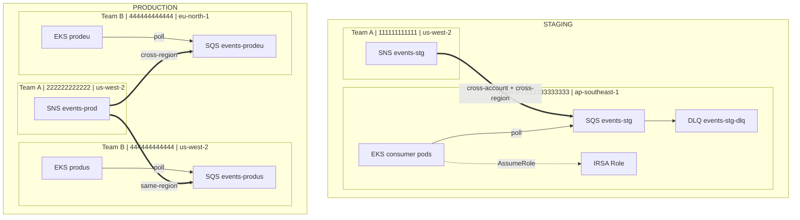

# Case Study 1 — Cross-Account SNS → SQS with IRSA

> **Folders:** `iam/stg/` (10 resources) · `iam/prod/` (15 resources)

## Scenario

Team A publish events qua SNS, Team B (chúng ta) consume qua SQS trên EKS — **cross-account, cross-region**.

```
Team A (Publisher)                    Team B — Chúng ta (Consumer)
─────────────────                    ────────────────────────────

Staging:                              Staging:
  Account: 111111111111                 Account: 333333333333
  Region:  us-west-2                    Region:  ap-southeast-1
  SNS:     events-stg                   SQS:     events-stg
                                        EKS:     consumer pods

Production:                           Production:
  Account: 222222222222                 Account: 444444444444
  Region:  us-west-2                    Region:  us-west-2  → SQS events-produs
  SNS:     events-prod                  Region:  eu-north-1 → SQS events-prodeu
                                        EKS:     consumer pods (cả 2 region)
```

---

## Architecture



---

## IAM Resources

| # | Resource | Ai tạo | Mục đích |
|---|----------|--------|----------|
| 1 | `aws_sns_topic` | Team A | SNS topic để publish events |
| 2 | `aws_sns_topic_policy` | Team A | Cho phép Team B subscribe |
| 3 | `aws_sqs_queue` | **Team B** | Queue nhận messages |
| 4 | `aws_sqs_queue` (DLQ) | **Team B** | Dead Letter Queue |
| 5 | `aws_sqs_queue_policy` | **Team B** | Cho phép SNS gửi vào SQS |
| 6 | `aws_sns_topic_subscription` | **Team B** | SQS subscribe SNS topic |
| 7 | `aws_iam_openid_connect_provider` | **Team B** | OIDC cho EKS cluster |
| 8 | `aws_iam_role` | **Team B** | IRSA role cho consumer pods |
| 9 | `aws_iam_policy` | **Team B** | SQS read/delete permissions |
| 10 | `aws_iam_role_policy_attachment` | **Team B** | Gắn policy vào role |

---

## Policy Analysis (3 layers)

| Layer | Policy Type | Trên resource nào | Principal | Action | Condition |
|:-----:|------------|-------------------|-----------|--------|-----------|
| **1** | SNS Topic Policy | SNS topic (Team A) | `AWS: Team B account root` | `sns:Subscribe, sns:Receive` | — |
| **2** | SQS Queue Policy | SQS queue (Team B) | `Service: sns.amazonaws.com` | `sqs:SendMessage` | `ArnEquals: aws:SourceArn = topic ARN` |
| **3** | IAM Trust + Permission | IAM Role (Team B) | `Federated: OIDC ARN` | `sts:AssumeRoleWithWebIdentity` + `sqs:ReceiveMessage` | `:sub` + `:aud` |

### Tại sao cần mỗi layer?

- **Layer 1 (SNS Topic Policy):** SNS mặc định chỉ cho phép cùng account subscribe. Cross-account cần explicit topic policy.
- **Layer 2 (SQS Queue Policy):** Không dùng `ArnEquals` condition = bất kỳ SNS topic nào cũng gửi được vào queue.
- **Layer 3 (IRSA Trust):** `:sub` condition chỉ đúng ServiceAccount trong đúng namespace mới assume role. `:aud` prevent token reuse.

---

## Message Flow

```
1. Team A app publishes event → SNS Topic (us-west-2)
2. SNS fan-out → delivers to all subscribed SQS queues
3. SQS queue (ap-southeast-1 hoặc eu-north-1) nhận message
4. EKS pod long-polls SQS (ReceiveMessage, wait 20s)
5. Pod processes → DeleteMessage
6. Nếu pod crash/timeout → message quay lại queue (visibility timeout)
7. Sau 3 lần fail → message chuyển vào DLQ
```

### Cross-Region Latency

| Path | Latency | Behavior |
|------|---------|----------|
| SNS us-west-2 → SQS us-west-2 | ~ms | Same-region, fastest |
| SNS us-west-2 → SQS ap-southeast-1 | ~100-200ms | Cross-region, AWS backbone |
| SNS us-west-2 → SQS eu-north-1 | ~100-200ms | Cross-region, AWS backbone |

SNS handles cross-region delivery automatically — không cần VPC peering hay Transit Gateway.

---

## So sánh Staging vs Production

| Aspect | Staging | Production |
|--------|---------|------------|
| Team A Account | 111111111111 | 222222222222 |
| Team B Account | 333333333333 | 444444444444 |
| SNS Region | us-west-2 | us-west-2 |
| SQS Regions | ap-southeast-1 | us-west-2 + eu-north-1 |
| Cross-region? | Yes (SNS→SQS) | Yes (SNS→SQS eu-north-1) |
| # SQS queues | 1 | 2 (fan-out) |
| # EKS clusters | 1 | 2 |
| IRSA OIDC trusts | 1 | 2 (dual-region) |
| Total resources | 10 | 15 |

---

## Kubernetes Configuration

```yaml
apiVersion: v1
kind: ServiceAccount
metadata:
  name: sqs-consumer
  namespace: events
  annotations:
    eks.amazonaws.com/role-arn: arn:aws:iam::444444444444:role/sqs-consumer-prod-role
---
apiVersion: apps/v1
kind: Deployment
metadata:
  name: sqs-consumer
  namespace: events
spec:
  template:
    spec:
      serviceAccountName: sqs-consumer
      containers:
        - name: consumer
          env:
            - name: SQS_QUEUE_URL
              value: "https://sqs.us-west-2.amazonaws.com/444444444444/events-produs"
            - name: AWS_DEFAULT_REGION
              value: "us-west-2"
```

---

## Validate

```bash
cd iam/stg
terraform init -input=false
terraform apply -auto-approve   # 10 resources
terraform output

cd ../prod
terraform init -input=false
terraform apply -auto-approve   # 15 resources
terraform output
```
