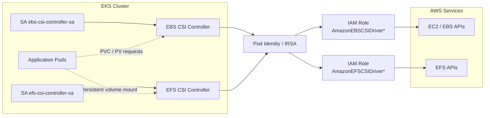
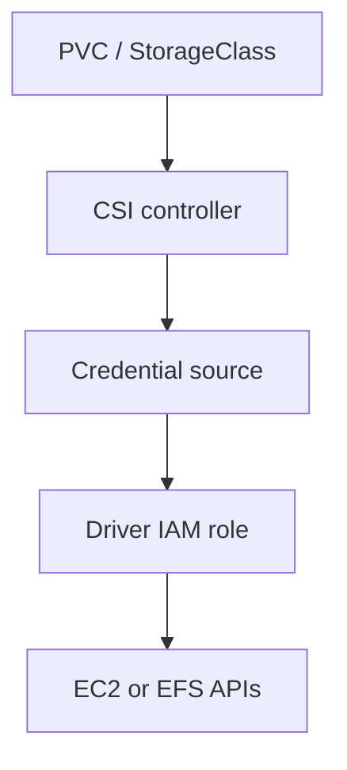
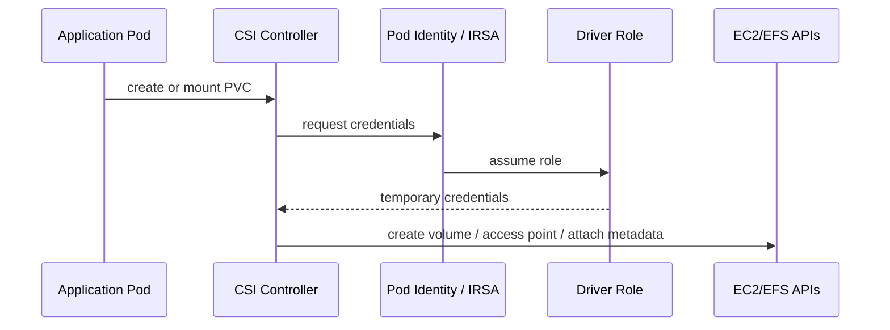
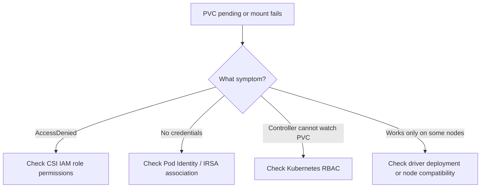

# Case Study 9 — EKS Storage Drivers: EBS CSI and EFS CSI

> **Folder:** `iam/storage-drivers/` · **Lab Type:** MiniStack runnable · **Scope:** Platform storage

## Scenario

Platform team triển khai **EBS CSI** và **EFS CSI** cho nhiều workloads trên EKS. Mục tiêu là gán đúng IAM role cho từng driver thay vì dựa vào node role, đồng thời hiểu tại sao AWS hiện ưu tiên **Pod Identity** cho các add-on này.

---

## Architecture



---

## Policy Layers

| Layer | Policy Type | Principal | Action | Ghi chú |
|:-----:|------------|-----------|--------|--------|
| **1** | Trust policy | OIDC / `pods.eks.amazonaws.com` | Assume driver role | Mỗi driver có role riêng |
| **2** | Permission policy | Driver role | EC2/EBS hoặc EFS actions | Thường bắt đầu từ AWS managed policy |
| **3** | Kubernetes RBAC | Driver service account | watch PVC/PV/storage classes | Không thay được IAM |



---

## Credential Flow



---

## Failure / Review Diagram



---

## Why this matters at work

- Storage permissions là phần nền nhưng thường bị bỏ qua.
- Nhiều cluster cũ nhét policy EBS/EFS vào node role, làm mọi pod trên node hưởng lợi quá mức.
- Đây là case tốt để học:
  - managed policy nào dành cho add-on
  - khi nào cần Pod Identity
  - blast radius khi driver role bị mở quá rộng

---

## Review Checklist

- EBS CSI và EFS CSI có đang dùng chung một role không?
- Driver có đang dựa vào node role thay vì pod role không?
- Managed policy của AWS có cần thu hẹp thêm bằng condition/tag/resource scope không?
- Có phân biệt controller permissions với app workload permissions không?

---

## Interview Questions

- Tại sao storage driver không nên dùng node role?
- Khi nào chọn Pod Identity thay vì IRSA cho CSI add-ons?
- Nếu PVC tạo được nhưng mount thất bại, bạn kiểm tra IAM ở đâu trước?

---

## Validate

```bash
cd iam/storage-drivers
terraform init -input=false
terraform apply -auto-approve
terraform output
terraform destroy -auto-approve
```

Lab này tạo **EBS volume + snapshot** để có tài nguyên storage thật trên MiniStack, cùng IAM roles cho EBS CSI và EFS CSI. Phần EFS ở mức IAM shape vì support matrix của repo chỉ khẳng định EBS.
